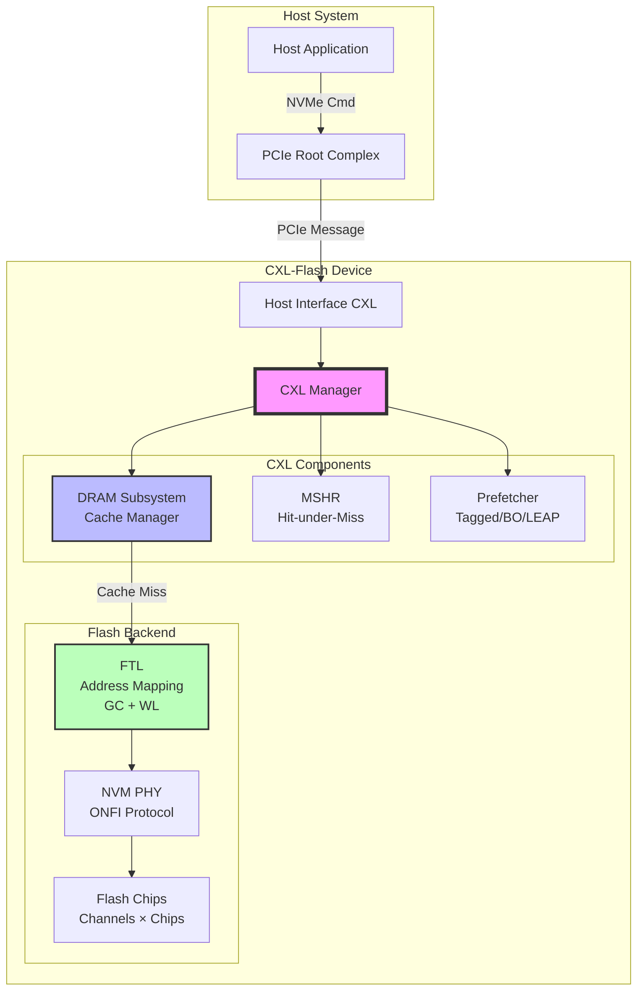
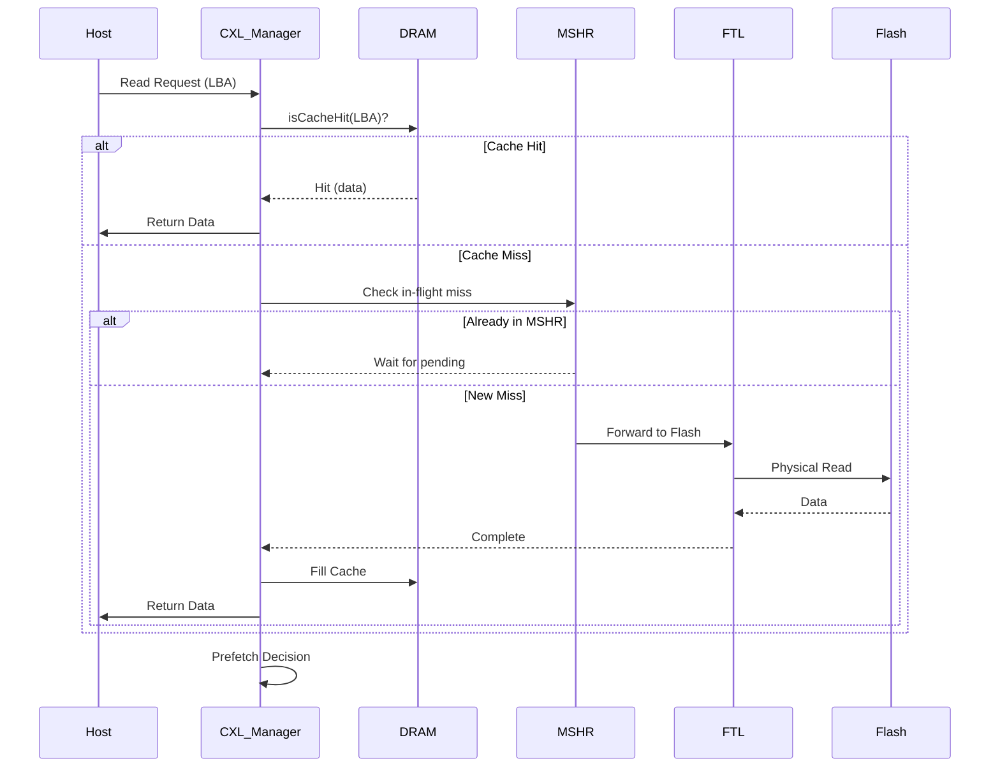

# MQSim_CXL 개발자 가이드

> CXL-enabled Flash Memory Device Simulator 개발자 문서

---

## 📌 TL;DR (3줄 요약)

1. **MQSim_CXL은 CXL(Compute Express Link) 프로토콜을 지원하는 Flash Memory 디바이스 시뮬레이터**로, Host Interface부터 Flash Chip까지 전체 스택을 Discrete Event Simulation으로 구현했습니다.

2. **핵심 아키텍처**: Host → CXL_Manager (DRAM Cache + Prefetcher + MSHR) → FTL (Address Mapping + GC + Wear-leveling) → Flash Backend로 구성되며, 각 레이어는 명확히 분리되어 있어 **Gem5의 Traffic Generator로 사용하려면 Host Interface 레이어를 추상화하고 CXL_Manager를 직접 호출**하면 됩니다.

3. **Gem5 연동 전략**: MQSim의 Discrete Event Engine을 Gem5의 Event System과 통합하고, `Host_Interface_CXL::Consume_pcie_message()`를 Gem5 Memory Controller에서 호출하여 memory request를 CXL-Flash로 전달하는 방식으로 구현 가능합니다.

---

## 🎯 이 문서의 목적

본 문서는 **MQSim_CXL을 Gem5에서 동작하는 CXL Traffic Generator로 활용**하려는 개발자를 위한 가이드입니다. 코드 구조, 시뮬레이션 흐름, 그리고 Gem5 연동 방법을 상세히 다룹니다.

---

## 📚 문서 구조

### [Chapter 1: 아키텍처 개요](docs/kr/01-architecture-overview.md)
- 프로젝트 전체 구조
- 주요 컴포넌트 다이어그램
- 디렉토리 구조 분석
- 핵심 클래스 관계도

### [Chapter 2: CXL 구현 상세](docs/kr/02-cxl-implementation.md)
- CXL_Manager 동작 원리
- DRAM Subsystem 구현
- Prefetcher 알고리즘
- MSHR (Miss Status Handling Register)
- Cache Replacement Policies

### [Chapter 3: 시뮬레이션 흐름](docs/kr/03-simulation-flow.md)
- Discrete Event Simulation Engine
- Request Processing Pipeline
- 시뮬레이션 초기화 과정
- 이벤트 스케줄링 메커니즘

### [Chapter 4: Gem5 연동 가이드](docs/kr/04-gem5-integration.md)
- Gem5 연동 전략
- Traffic Generator 구현 방법
- Event System 통합
- 인터페이스 설계 가이드
- 예제 코드

---

## 🚀 빠른 시작

### 프로젝트 개요

```
MQSim_CXL
├── src/
│   ├── cxl/              # CXL 관련 핵심 구현 (20개 파일)
│   ├── ssd/              # SSD/Flash 시뮬레이션 (47개 파일)
│   ├── host/             # Host 인터페이스 (11개 파일)
│   ├── sim/              # Discrete Event Engine (7개 파일)
│   ├── exec/             # 실행 및 설정 관리 (7개 파일)
│   └── nvm_chip/         # Flash 칩 모델 (8개 파일)
├── config.txt            # CXL 아키텍처 설정
├── ssdconfig.xml         # SSD 디바이스 스펙
└── workload.xml          # 워크로드 정의
```

### 핵심 통계 (Lines of Code)
- **전체**: ~19,800 LOC (C++)
- **CXL 관련**: ~6,000 LOC
- **가장 큰 파일**: `Host_Interface_CXL.cpp` (1,482 LOC)

---

## 🏗️ 핵심 아키텍처 (High-Level)



---

## 🔑 핵심 개념

### CXL (Compute Express Link)
- **목적**: 메인 메모리 확장을 위한 고속 인터커넥트
- **MQSim_CXL 구현**: CXL.mem 프로토콜 시뮬레이션 (PCIe 기반)
- **핵심 특징**: Device-side DRAM cache를 통한 레이턴시 최적화

### DRAM Subsystem
- **역할**: Host와 Flash 사이의 중간 캐시 레이어
- **크기**: 설정 가능 (일반적으로 64MB ~ 8GB)
- **정책**: Random, FIFO, LRU, LRU-2, LFU, LRFU, CFLRU
- **효과**: Flash 접근을 수십 μs → 수백 ns로 감소

### MSHR (Miss Status Handling Register)
- **역할**: Cache miss 중인 요청 추적
- **기능**:
  - 같은 주소에 대한 중복 Flash 접근 방지
  - Hit-under-miss 지원
  - 최대 1024개 진행 중인 miss 추적

### Prefetcher
- **알고리즘**:
  - **Tagged**: Next-N-Line prefetching (degree, offset 설정 가능)
  - **Best-Offset (BO)**: 최적 offset 학습
  - **LEAP**: Lightweight Prefetcher
  - **Feedback Direct**: 정확도 기반 동적 조정

---

## 📊 주요 데이터 흐름

### Read Request 처리 과정



---

## 🛠️ 빌드 및 실행

### Linux
```bash
cd /home/user/MQSim_CXL
make clean
make -j$(nproc)
./MQSim -i ssdconfig.xml -w workload.xml
```

### Windows
```
Visual Studio 2022에서 MQSim.sln 열기
Release 모드로 변경
빌드 후 실행
```

### 주요 설정 파일

#### config.txt (CXL 아키텍처)
```
DRAM_mode 0                    # 0: CXL-flash, 1: DRAM only
Has_cache 1                    # DRAM cache 활성화
DRAM_size 67108864             # 64MB (bytes)
Cache_placement 16             # Set associativity
Cache_policy CFLRU             # 정책: FIFO, LRU, CFLRU 등
Prefetcher Best-offset         # Prefetcher 알고리즘
Has_mshr 1                     # MSHR 활성화
```

#### ssdconfig.xml (Flash 디바이스)
```xml
<Flash_Channel_Count>8</Flash_Channel_Count>
<Chip_No_Per_Channel>8</Chip_No_Per_Channel>
<Page_Read_Latency_LSB>3000</Page_Read_Latency_LSB>  <!-- ns -->
<Page_Program_Latency_LSB>100000</Page_Program_Latency_LSB>
<Block_Erase_Latency>1000000</Block_Erase_Latency>
```

---

## 📈 시뮬레이션 출력

### Results 디렉토리
- **overall.txt**: Cache hit/miss, prefetch 통계, flash 접근 횟수
- **latency_result.txt**: 각 요청의 레이턴시 (nanosecond)
- **repeated_access.txt**: 반복 접근 패턴 분석

---

## 🎓 추가 리소스

### 논문
- **"Overcoming the Memory Wall with CXL-Enabled SSDs"** (USENIX ATC'23)
- MQSim-E: Enterprise SSD Simulator (CAL'22)
- MQSim: Multi-Queue SSD Framework (FAST'18)

### 관련 프로젝트
- [Trace Generator](https://github.com/dgist-datalab/trace_generator)
- [MQSim CXL Linux](https://github.com/spypaul/MQSim_CXL_Linux)
- [Trace Translation](https://github.com/spypaul/trace_translation)

### 트레이스 파일
- [Zenodo Dataset](https://doi.org/10.5281/zenodo.7916219) - BERT, PageRank, YCSB 등

---

## 🤝 기여자

- S4 Group (Syracuse University)
- DGIST DataLab
- DATOS Lab (Soongsil University)
- FADU

---

## 📞 연락처

문제가 있거나 질문이 있으면 GitHub Issues를 통해 문의하세요.

---

**다음 챕터**: [Chapter 1: 아키텍처 개요](docs/kr/01-architecture-overview.md) →
