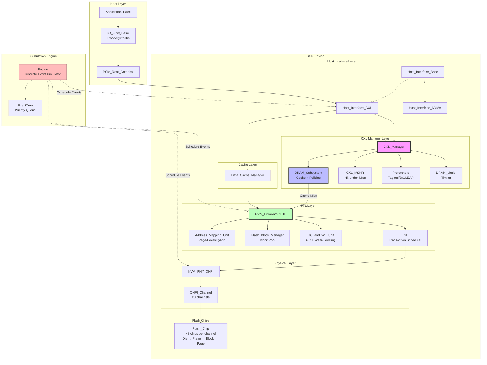
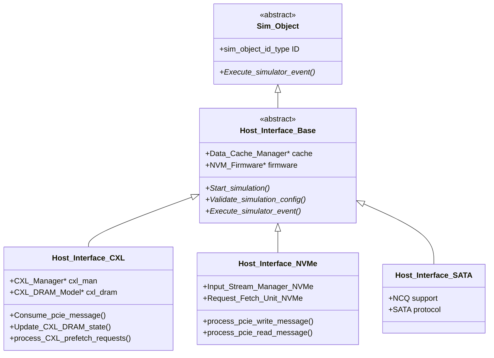
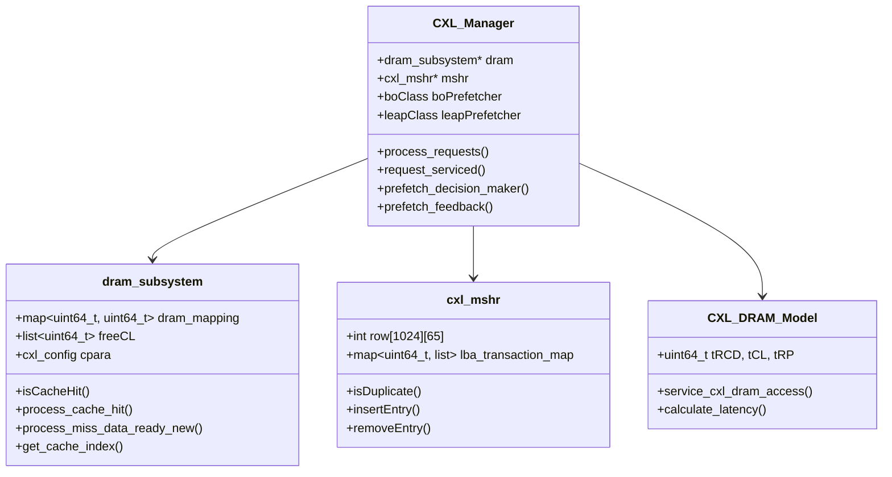
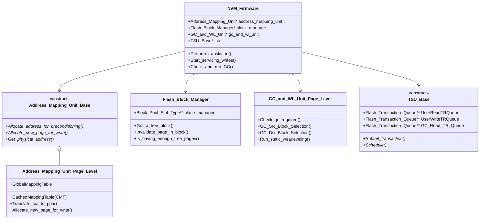
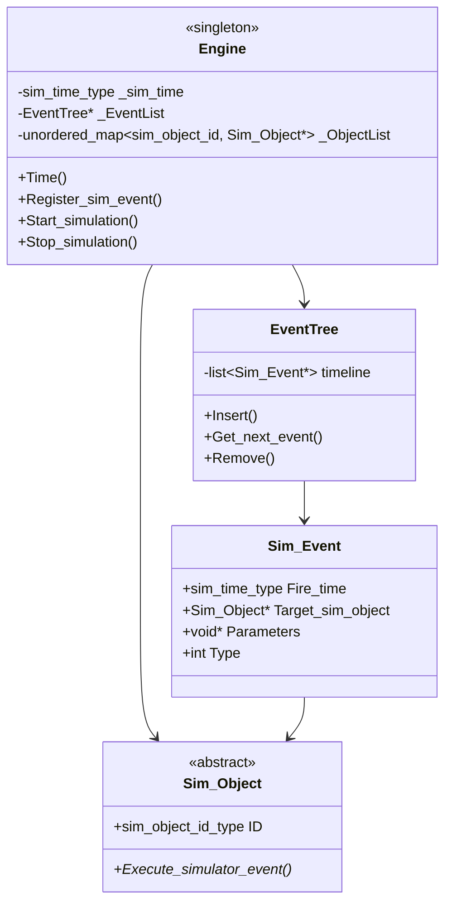
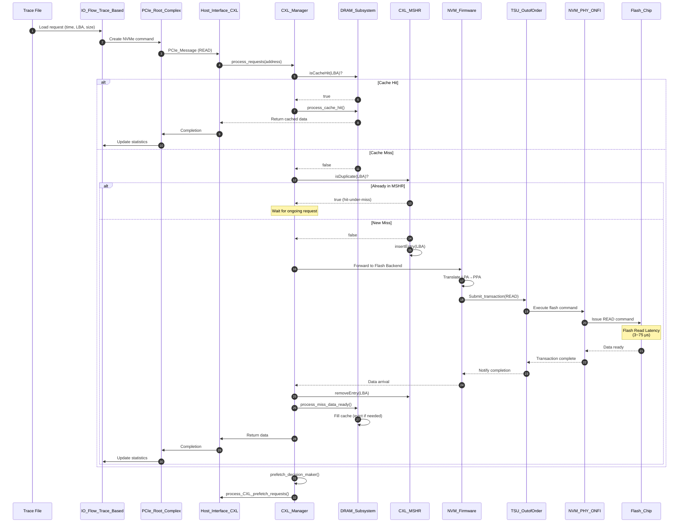
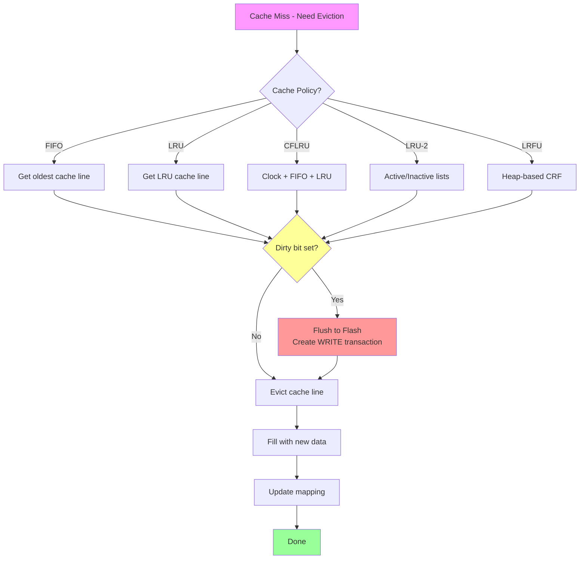
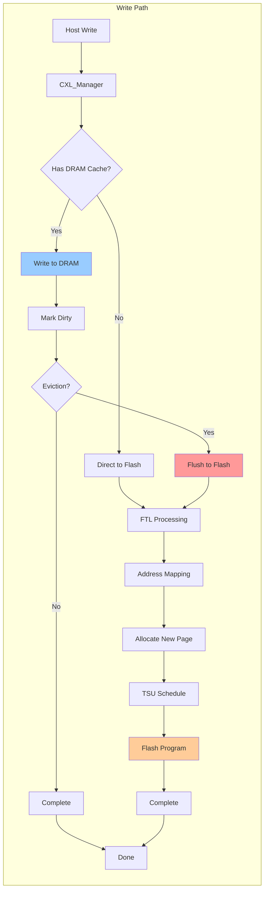
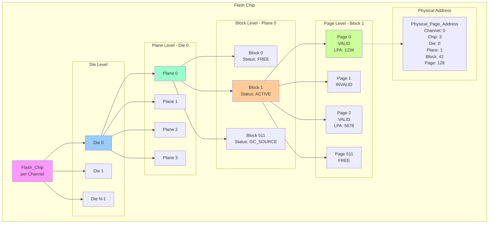

# Chapter 1: 아키텍처 개요

[← 메인으로](../../DEVELOPER_GUIDE_KR.md) | [다음: CXL 구현 →](02-cxl-implementation.md)

---

## 목차
1. [프로젝트 전체 구조](#프로젝트-전체-구조)
2. [디렉토리 구조 분석](#디렉토리-구조-분석)
3. [핵심 컴포넌트 다이어그램](#핵심-컴포넌트-다이어그램)
4. [클래스 계층 구조](#클래스-계층-구조)
5. [데이터 경로 분석](#데이터-경로-분석)

---

## 프로젝트 전체 구조

### 개요
MQSim_CXL은 CXL 프로토콜을 지원하는 Flash Memory 디바이스의 **trace-driven simulator**입니다. Discrete Event Simulation (DES) 방식을 사용하여 nanosecond 단위의 정확한 타이밍 시뮬레이션을 제공합니다.

### 핵심 특징
- **Full Stack Simulation**: Host Interface → Cache → FTL → Flash Chip
- **CXL.mem 지원**: Device-side DRAM cache with prefetching
- **정확한 타이밍**: Flash read/program/erase latency 모델링
- **확장 가능**: 다양한 cache policy, prefetcher 알고리즘

---

## 디렉토리 구조 분석

```
MQSim_CXL/
├── src/                              # 소스 코드 루트
│   ├── cxl/                          # ⭐ CXL 구현 (20 files, ~6K LOC)
│   │   ├── Host_Interface_CXL.h/cpp  # CXL 호스트 인터페이스 (1,482 LOC)
│   │   ├── CXL_Manager              # 핵심 CXL 관리자
│   │   ├── DRAM_Subsystem.h/cpp     # DRAM 캐시 구현 (909 LOC)
│   │   ├── CXL_MSHR.h/cpp           # Miss Status Handling Register
│   │   ├── CXL_Config.h/cpp         # 설정 파서
│   │   ├── DRAM_Model.h/cpp         # DRAM 타이밍 모델
│   │   ├── Prefetching_Alg.h/cpp    # Prefetcher 알고리즘
│   │   ├── CFLRU.h/cpp              # Clock-FIFO-LRU 정책
│   │   └── lrfu_heap.h/cpp          # LRFU 정책 구현
│   │
│   ├── ssd/                          # SSD 시뮬레이션 (47 files)
│   │   ├── Host_Interface_Base.h    # 호스트 인터페이스 추상 클래스
│   │   ├── Host_Interface_NVMe.h    # NVMe 프로토콜
│   │   ├── FTL.h/cpp                # Flash Translation Layer (1,083 LOC)
│   │   ├── Address_Mapping_Unit_*   # LBA→PBA 매핑
│   │   ├── Flash_Block_Manager.*    # 블록 관리 및 상태 추적
│   │   ├── GC_and_WL_Unit_*         # Garbage Collection + Wear Leveling
│   │   ├── TSU_*.h/cpp              # Transaction Scheduling Unit
│   │   ├── Data_Cache_Manager_*     # 데이터 캐시 관리
│   │   ├── NVM_PHY_*.h/cpp          # Physical Layer (ONFI)
│   │   ├── ONFI_Channel_*.h/cpp     # 채널 컨트롤러
│   │   └── NVM_Transaction_*.h/cpp  # Flash 트랜잭션
│   │
│   ├── host/                         # 호스트 시스템 (11 files)
│   │   ├── IO_Flow_Base.h/cpp       # I/O 플로우 추상 클래스
│   │   ├── IO_Flow_Trace_Based.h    # Trace 기반 워크로드
│   │   ├── IO_Flow_Synthetic.h      # Synthetic 워크로드
│   │   ├── PCIe_Root_Complex.h      # PCIe 루트 컴플렉스
│   │   ├── PCIe_Switch.h            # PCIe 스위치
│   │   └── PCIe_Link.h              # PCIe 링크 (대역폭 모델링)
│   │
│   ├── sim/                          # ⭐ Discrete Event Engine (7 files)
│   │   ├── Engine.h/cpp             # 시뮬레이션 엔진 (singleton)
│   │   ├── EventTree.h/cpp          # 이벤트 우선순위 큐 (503 LOC)
│   │   ├── Sim_Object.h             # 시뮬레이션 객체 기본 클래스
│   │   ├── Sim_Event.h              # 이벤트 표현
│   │   └── Sim_Reporter.h           # 통계 수집
│   │
│   ├── exec/                         # 실행 및 설정 (7 files)
│   │   ├── SSD_Device.h/cpp         # SSD 디바이스 통합 (436 LOC)
│   │   ├── Host_System.h/cpp        # 호스트 시스템 통합
│   │   ├── Execution_Parameter_Set  # 실행 파라미터
│   │   ├── Device_Parameter_Set     # 디바이스 설정 (630 LOC)
│   │   └── IO_Flow_Parameter_Set    # 워크로드 설정 (479 LOC)
│   │
│   ├── nvm_chip/flash_memory/        # Flash 칩 모델 (8 files)
│   │   ├── Flash_Chip.h/cpp         # 칩 레벨 시뮬레이터
│   │   ├── Die.h/cpp                # Die 관리
│   │   ├── Plane.h/cpp              # Plane 연산
│   │   ├── Block.h/cpp              # 블록 상태
│   │   ├── Page.h                   # 페이지 상태
│   │   └── Physical_Page_Address.h  # 주소 변환
│   │
│   ├── utils/                        # 유틸리티
│   │   ├── rapidxml/                # XML 파서
│   │   ├── XMLWriter.h/cpp          # 결과 출력
│   │   └── RandomGenerator.h        # 랜덤 생성기
│   │
│   └── main.cpp                      # ⭐ 프로그램 진입점
│
├── config.txt                        # CXL 아키텍처 설정
├── ssdconfig.xml                     # SSD 디바이스 스펙
├── workload.xml                      # 워크로드 정의
├── Makefile                          # Linux 빌드
└── MQSim.sln                         # Windows (VS 2022)
```

### 주요 디렉토리별 역할

| 디렉토리 | 역할 | LOC | 주요 파일 |
|---------|------|-----|----------|
| **src/cxl/** | CXL 프로토콜 및 DRAM 캐시 구현 | ~6,000 | Host_Interface_CXL.cpp (1,482) |
| **src/ssd/** | SSD 시뮬레이션 (FTL, GC, 스케줄링) | ~8,000 | FTL.cpp, Address_Mapping_Unit_Page_Level.cpp |
| **src/sim/** | Discrete Event Engine | ~1,500 | EventTree.cpp (503) |
| **src/host/** | 호스트 I/O 생성 및 PCIe | ~2,000 | IO_Flow_Trace_Based.cpp |
| **src/nvm_chip/** | Flash 칩 하드웨어 모델 | ~1,500 | Flash_Chip.cpp |

---

## 핵심 컴포넌트 다이어그램

### 전체 시스템 아키텍처



---

## 클래스 계층 구조

### 1. Host Interface 계층



### 2. CXL Manager 및 서브시스템



### 3. FTL (Flash Translation Layer) 계층



### 4. Discrete Event Simulation Engine



---

## 데이터 경로 분석

### Read Request 전체 경로



### Cache Miss 시 Eviction 경로



### Write Request 처리



---

## Flash 하드웨어 계층 구조

### Flash Chip 내부 구조



### Flash Command Execution 타이밍

```mermaid
gantt
    title Flash Command Execution Timeline
    dateFormat X
    axisFormat %L

    section Channel 0
    CMD Transfer       :0, 100
    Address Transfer   :100, 200
    Data Transfer (32KB) :crit, 200, 2400

    section Flash Chip
    tRCD (Row Access)  :300, 13
    Data Read (Page)   :crit, 313, 3000
    tCL (Column)       :3313, 13
    Data Out           :3326, 2000

    section Completion
    Return to Host     :done, 5326, 100
```



---

## Configuration 파일 구조

### config.txt (CXL 아키텍처)

```
┌─────────────────────────────────────────┐
│ CXL Configuration (config.txt)          │
├─────────────────────────────────────────┤
│ DRAM_mode           0                   │ ← 0: CXL-flash, 1: DRAM only
│ Has_cache           1                   │ ← Enable DRAM cache
│ DRAM_size           67108864            │ ← 64 MB (bytes)
│ Mix_mode            1                   │ ← Mix demand + prefetch
│ Cache_portion_percentage  100           │ ← Cache size ratio
│ Has_mshr            1                   │ ← Enable MSHR
│ Cache_placement     16                  │ ← 16-way set associative
│ Cache_policy        CFLRU               │ ← FIFO/LRU/CFLRU/...
│ Prefetcher          Best-offset         │ ← No/Tagged/BO/LEAP
│ Total_number_of_requests  20000000      │ ← Workload size
└─────────────────────────────────────────┘
```

### ssdconfig.xml (Flash Device)

```
┌──────────────────────────────────────────────────┐
│ SSD Configuration (ssdconfig.xml)                │
├──────────────────────────────────────────────────┤
│ Flash Hierarchy:                                 │
│   - Channels: 8                                  │
│   - Chips per Channel: 8                         │
│   - Dies per Chip: 1                             │
│   - Planes per Die: 4                            │
│   - Blocks per Plane: 512                        │
│   - Pages per Block: 512                         │
│   - Page Capacity: 16 KB                         │
│                                                  │
│ Flash Technology: SLC/MLC/TLC                    │
│                                                  │
│ Latencies (nanoseconds):                         │
│   - Page Read: 3,000 (SLC) ~ 75,000 (TLC MSB)   │
│   - Page Program: 100,000 ~ 1,800,000           │
│   - Block Erase: 1,000,000 ~ 10,000,000         │
│                                                  │
│ FTL Configuration:                               │
│   - Address Mapping: PAGE_LEVEL                  │
│   - GC Policy: GREEDY/RGA/RANDOM                 │
│   - Overprovisioning: 12.7%                      │
│   - Transaction Scheduling: OUT_OF_ORDER         │
└──────────────────────────────────────────────────┘
```

---

## 통계 및 출력

### overall.txt 출력 예시

```
=== CXL-Flash Statistics ===
Total Accesses:           20,000,000
Cache Hit Count:          18,500,000  (92.5%)
Cache Miss Count:          1,500,000  (7.5%)
Prefetch Hit Count:          800,000  (4.0%)
Flash Read Count:          1,200,000
Flash Write Count (Flush):   400,000
Hit-under-Miss Count:         50,000

=== Prefetcher Performance ===
Coverage:                      53.3%
Accuracy:                      66.7%
Lateness:                       0.8%
Pollution:                     12.0%

=== Flash Backend ===
Total Flash Accesses:        1,600,000
Average Queue Depth:              12.4
GC Invocations:                  2,340
Pages Moved by GC:             120,000

=== Lifetime Estimation ===
Device Lifetime:              2.3 years (at current workload)
```

---

## 주요 인터페이스 정리

### Gem5 연동 시 주요 진입점

| 클래스/함수 | 역할 | 위치 |
|-----------|------|------|
| `Host_Interface_CXL::Consume_pcie_message()` | PCIe 메시지 수신 | Host_Interface_CXL.h:197 |
| `CXL_Manager::process_requests()` | CXL 요청 처리 | Host_Interface_CXL.h:39 |
| `Engine::Register_sim_event()` | 이벤트 스케줄링 | Engine.h:29 |
| `Engine::Time()` | 현재 시뮬레이션 시간 | Engine.h:28 |
| `SSD_Device::Execute_simulator_event()` | 이벤트 실행 | SSD_Device.h:52 |

---

## 다음 챕터

이제 CXL 구현의 상세한 내용을 살펴보겠습니다.

[다음: Chapter 2 - CXL 구현 상세 →](02-cxl-implementation.md)

---

[← 메인으로](../../DEVELOPER_GUIDE_KR.md)
