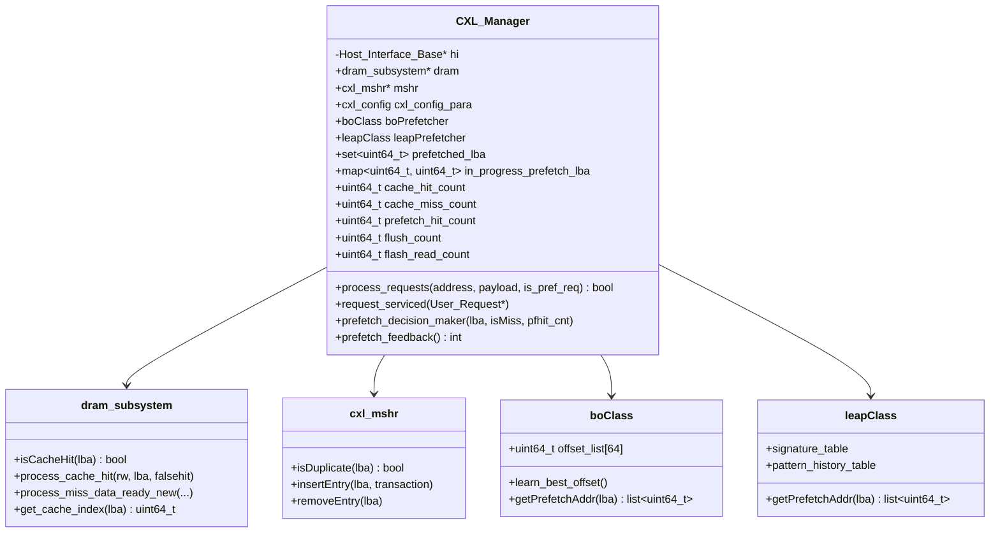
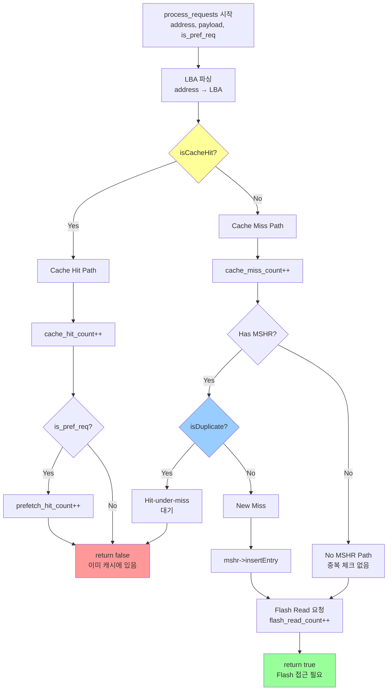
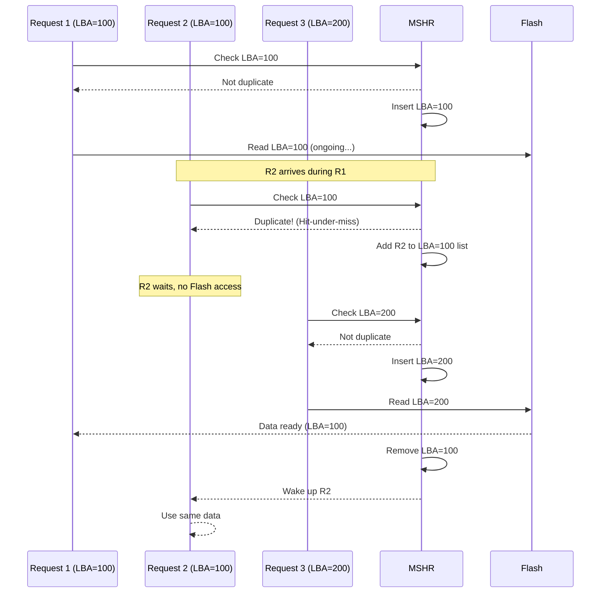
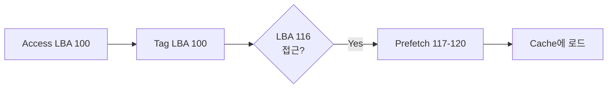
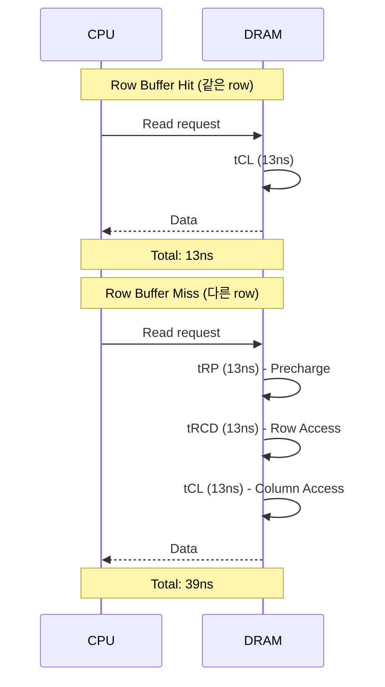

# Chapter 2: CXL 구현 상세

[← Chapter 1](01-architecture-overview.md) | [메인으로](../../DEVELOPER_GUIDE_KR.md) | [다음: 시뮬레이션 흐름 →](03-simulation-flow.md)

---

## 목차
1. [CXL_Manager 핵심 구조](#cxl_manager-핵심-구조)
2. [DRAM Subsystem 상세](#dram-subsystem-상세)
3. [Cache Replacement Policies](#cache-replacement-policies)
4. [MSHR 구현](#mshr-구현)
5. [Prefetcher 알고리즘](#prefetcher-알고리즘)
6. [DRAM Timing 모델](#dram-timing-모델)
7. [코드 분석](#코드-분석)

---

## CXL_Manager 핵심 구조

### 개요
`CXL_Manager`는 CXL-Flash 디바이스의 핵심 컨트롤러로, **DRAM cache**, **MSHR**, **Prefetcher**를 통합 관리합니다.

**위치**: `src/cxl/Host_Interface_CXL.h:33-107`

### 클래스 다이어그램



### 주요 멤버 변수

```cpp
// src/cxl/Host_Interface_CXL.h:44-106

class CXL_Manager {
public:
    // ===== 핵심 서브시스템 =====
    cxl_mshr* mshr;                          // Miss Status Handling Register
    dram_subsystem* dram;                    // DRAM 캐시 관리자

    // ===== Prefetcher 관련 =====
    set<uint64_t>* prefetched_lba;           // Prefetch된 LBA 추적
    map<uint64_t, uint64_t>* in_progress_prefetch_lba;  // 진행 중인 prefetch
    uint64_t prefetch_queue_size{1024};      // Prefetch 큐 크기

    // Tagged Prefetcher
    set<uint64_t> tagAssertedLBA;            // Tag가 설정된 LBA
    uint16_t prefetchK{4};                   // Degree (한 번에 prefetch할 개수)
    uint16_t prefetch_timing_offset{16};     // Offset (언제 prefetch 시작)

    // Best-offset Prefetcher
    boClass boPrefetcher;

    // LEAP Prefetcher
    leapClass leapPrefetcher;

    // ===== 통계 =====
    uint64_t cache_miss_count{0};
    uint64_t cache_hit_count{0};
    uint64_t prefetch_hit_count{0};
    uint64_t flush_count{0};
    uint64_t flash_read_count{0};
    uint64_t prefetch_pollution_count{0};    // Prefetch 오염 (사용되지 않음)

    // ===== 설정 =====
    cxl_config cxl_config_para;              // CXL 아키텍처 설정
};
```

### process_requests() - 핵심 처리 함수



**코드 예시** (단순화):
```cpp
// src/cxl/Host_Interface_CXL.cpp (pseudo-code)

bool CXL_Manager::process_requests(uint64_t address, void* payload, bool is_pref_req) {
    // 1. LBA 추출
    uint64_t lba = extract_lba(address, payload);

    // 2. Cache Hit 체크
    if (dram->isCacheHit(lba)) {
        cache_hit_count++;
        if (is_pref_req) {
            prefetch_hit_count++;  // Prefetch가 유용했음
        }
        return false;  // 이미 캐시에 있으므로 Flash 접근 불필요
    }

    // 3. Cache Miss
    cache_miss_count++;

    // 4. MSHR 체크 (중복 방지)
    if (cxl_config_para.has_mshr) {
        if (mshr->isDuplicate(lba)) {
            // Hit-under-miss: 같은 LBA에 대한 진행 중인 요청이 있음
            return false;
        }
        mshr->insertEntry(lba, transaction);
    }

    // 5. Flash Read 필요
    flash_read_count++;
    return true;  // Flash backend로 전달
}
```

---

## DRAM Subsystem 상세

### 개요
`dram_subsystem`은 Device-side DRAM cache의 핵심 구현으로, **Set-Associative Cache** 구조를 사용합니다.

**위치**: `src/cxl/DRAM_Subsystem.h:55-116`

### Cache 구조

```
┌────────────────────────────────────────────────────────────────┐
│ Set-Associative Cache Structure                                │
├────────────────────────────────────────────────────────────────┤
│                                                                │
│  LBA (Logical Block Address, 4KB aligned)                     │
│  ┌───────────────────┬──────────────┬───────────────┐         │
│  │      Tag          │  Set Index   │    Offset     │         │
│  └───────────────────┴──────────────┴───────────────┘         │
│         52 bits           8 bits          12 bits             │
│                                                                │
│  Set 0:  [Way 0] [Way 1] ... [Way 15]  ← 16-way assoc        │
│  Set 1:  [Way 0] [Way 1] ... [Way 15]                         │
│  ...                                                           │
│  Set 255: [Way 0] [Way 1] ... [Way 15]                        │
│                                                                │
│  Total Cache Lines = 256 sets × 16 ways = 4096                │
│  Cache Size = 4096 × 4KB = 16 MB                              │
└────────────────────────────────────────────────────────────────┘
```

### 주요 데이터 구조

```cpp
// src/cxl/DRAM_Subsystem.h:76-115

class dram_subsystem {
private:
    cxl_config cpara;  // 설정

    // ===== Cache Line 관리 =====
    map<uint64_t, uint64_t>* dram_mapping;  // LBA → Cache Line Index
    list<uint64_t>* freeCL;                  // Free cache line list

    // ===== Set-Associative를 위한 구조 =====
    vector<list<uint64_t>*>* all_freeCL;     // Set별 free list
    vector<vector<uint64_t>*>* all_cachedlba; // Set별 cached LBA

    // ===== Policy별 자료구조 =====
    vector<list<uint64_t>*>* all_fifocachedlba;   // FIFO
    vector<CFLRU*>* all_cflrucachedlba;           // CFLRU
    vector<lfuHeap*>* all_lfucachedlba;           // LFU
    vector<lrfuHeap*>* all_lrfucachedlba;         // LRFU
    vector<lruTwoListClass*>* all_lru2cachedlba;  // LRU-2

    // ===== Dirty bit tracking =====
    map<uint64_t, uint64_t>* dirtyCL;        // Cache Line Index → Write Count
    vector<map<uint64_t, uint64_t>*>* all_dirtyCL;  // Set별

    // ===== Mix mode (demand + prefetch 분리) =====
    map<uint64_t, uint64_t>* pref_dram_mapping;
    list<uint64_t>* pref_freeCL;
    // ... prefetch 전용 자료구조

public:
    uint64_t eviction_count{0};
    uint64_t flush_count{0};
};
```

### isCacheHit() 구현

```cpp
// src/cxl/DRAM_Subsystem.cpp (pseudo-code)

bool dram_subsystem::isCacheHit(uint64_t lba) {
    // Set-associative index 계산
    uint64_t set_index = (lba / cpara.set_associativity) % num_sets;

    // 해당 set에서 LBA 검색
    if (cpara.mix_mode) {
        // Demand와 prefetch를 같이 관리
        return (dram_mapping->find(lba) != dram_mapping->end());
    } else {
        // 분리 관리
        bool demand_hit = (dram_mapping->find(lba) != dram_mapping->end());
        bool pref_hit = (pref_dram_mapping->find(lba) != pref_dram_mapping->end());
        return demand_hit || pref_hit;
    }
}
```

### process_miss_data_ready_new() - Eviction 처리

```mermaid
flowchart TD
    START[Miss Data Ready<br/>데이터가 Flash에서 도착]

    START --> CALC_SET[Set Index 계산]
    CALC_SET --> CHECK_FREE{Free CL 있음?}

    CHECK_FREE -->|Yes| USE_FREE[Free CL 사용]
    CHECK_FREE -->|No| EVICT[Eviction 필요]

    EVICT --> SELECT_VICTIM{Policy로<br/>victim 선택}

    SELECT_VICTIM -->|FIFO| FIFO_SELECT[FIFO: oldest]
    SELECT_VICTIM -->|LRU| LRU_SELECT[LRU: least recent]
    SELECT_VICTIM -->|CFLRU| CFLRU_SELECT[CFLRU: clock]
    SELECT_VICTIM -->|LRU-2| LRU2_SELECT[LRU-2: inactive]
    SELECT_VICTIM -->|LRFU| LRFU_SELECT[LRFU: heap top]

    FIFO_SELECT --> CHECK_DIRTY
    LRU_SELECT --> CHECK_DIRTY
    CFLRU_SELECT --> CHECK_DIRTY
    LRU2_SELECT --> CHECK_DIRTY
    LRFU_SELECT --> CHECK_DIRTY

    CHECK_DIRTY{Dirty bit?}

    CHECK_DIRTY -->|Yes| FLUSH[Flash에 Write<br/>flush_count++]
    CHECK_DIRTY -->|No| REMOVE

    FLUSH --> REMOVE[Victim 제거<br/>eviction_count++]

    USE_FREE --> FILL
    REMOVE --> FILL[새 데이터로 채움]

    FILL --> UPDATE_MAP[Mapping 업데이트<br/>dram_mapping[lba] = cl_index]

    UPDATE_MAP --> UPDATE_POLICY[Policy 자료구조 업데이트]

    UPDATE_POLICY --> DONE[완료]

    style CHECK_FREE fill:#ff9
    style CHECK_DIRTY fill:#f99
    style FLUSH fill:#f66
    style DONE fill:#9f9
```

---

## Cache Replacement Policies

### 지원 정책 목록

| 정책 | 설명 | 복잡도 | 특징 |
|-----|------|--------|------|
| **Random** | 무작위 선택 | O(1) | 가장 단순, 성능 예측 어려움 |
| **FIFO** | First-In-First-Out | O(1) | 구현 간단, 재사용성 무시 |
| **LRU** | Least Recently Used | O(1) with list | 재사용성 고려, 널리 사용됨 |
| **LRU-2** | Two-level LRU | O(1) | Active/Inactive list 분리 |
| **LFU** | Least Frequently Used | O(log N) | 빈도 기반, heap 사용 |
| **LRFU** | LRU + LFU 결합 | O(log N) | 시간 + 빈도 모두 고려 |
| **CFLRU** | Clock + FIFO + LRU | O(1) | Clock algorithm 기반 |

### 1. FIFO (First-In-First-Out)

**자료구조**: `list<uint64_t>` (per set)

```cpp
// Insertion
void insert(uint64_t lba) {
    fifo_list->push_back(lba);  // 뒤에 추가
}

// Eviction
uint64_t evict() {
    uint64_t victim = fifo_list->front();  // 앞에서 제거
    fifo_list->pop_front();
    return victim;
}
```

```
[Oldest] → [LBA 100] → [LBA 200] → [LBA 300] → [Newest]
             ↑ evict
```

### 2. LRU (Least Recently Used)

**자료구조**: `list<uint64_t>` + `map<uint64_t, iterator>`

```cpp
// Insertion
void insert(uint64_t lba) {
    lru_list->push_front(lba);  // 최신은 항상 앞에
}

// Cache Hit - Move to front
void hit(uint64_t lba) {
    lru_list->remove(lba);
    lru_list->push_front(lba);  // MRU 위치로 이동
}

// Eviction
uint64_t evict() {
    uint64_t victim = lru_list->back();  // 가장 오래된 것
    lru_list->pop_back();
    return victim;
}
```

```
[MRU] → [LBA 300] → [LBA 200] → [LBA 100] → [LRU]
                                    ↑ evict
```

### 3. LRU-2 (Two-Level LRU)

**자료구조**: Active List + Inactive List

**위치**: `src/cxl/DRAM_Subsystem.h:14-28`

```cpp
class lruTwoListClass {
private:
    list<uint64_t> active;      // 자주 사용됨
    list<uint64_t> inactive;    // 한 번만 사용됨
    uint64_t activeBound;       // Active list 최대 크기

public:
    void add(uint64_t lba);                          // 새로운 LBA (inactive에 추가)
    void updateWhenHit(uint64_t lba, bool& falsehit); // Hit 시 처리
    uint64_t evictLBA();                             // Eviction (inactive에서)
};
```

**동작 원리**:
```
New LBA → Inactive List
  ↓ Hit again
Active List (보호됨)

Eviction: Inactive에서 먼저 제거
```

```
Active List   [LBA 500] → [LBA 400] → [LBA 300]  (보호)
                ↑
Inactive List [LBA 200] → [LBA 100]              (evict)
                            ↑ victim
```

### 4. CFLRU (Clock + FIFO + LRU)

**위치**: `src/cxl/CFLRU.h:11-48`

**자료구조**:
```cpp
class CFLRU {
private:
    list<CLFRUNode*> CL;  // Cache line list
    list<CLFRUNode*>::iterator clock_hand;  // Clock hand
    uint64_t WR, WI;      // Window Region, Window Inactive

public:
    void add(uint64_t lba);
    uint64_t evictLBA();
    void updateWhenHit(uint64_t lba);
};

class CLFRUNode {
    uint64_t lba;
    bool referenced;  // Clock bit
    uint8_t region;   // FIFO/LRU/Clock region
};
```

**동작**:
```
┌─────────────────────────────────────┐
│ FIFO Region │ LRU Region │ Clock   │
│  (New data) │ (Active)   │ (Victim)│
└─────────────────────────────────────┘
                              ↑ clock_hand
```

### 5. LRFU (Least Recently/Frequently Used)

**위치**: `src/cxl/lrfu_heap.h`

**수식**:
```
CRF(x, t) = Σ (1/p)^(λ × (t - τ))
```
- `p`: 가중치 (보통 2)
- `λ`: decay factor
- `t`: 현재 시간
- `τ`: 과거 접근 시간

**자료구조**: Min-Heap

```cpp
class lrfuHeap {
private:
    vector<lrfuNode> h;             // Heap
    map<uint64_t, uint64_t> m;      // LBA → heap index
    double p, lambda;               // Parameters

    double calculateCRF(uint64_t current_time, vector<uint64_t>& access_times);

public:
    void add(uint64_t addr, uint64_t time);
    uint64_t top();  // CRF가 가장 낮은 것 = victim
    void update(uint64_t addr, uint64_t time);
};
```

---

## MSHR 구현

### 개요
MSHR(Miss Status Handling Register)은 **Cache miss 중인 요청을 추적**하여 **같은 주소에 대한 중복 Flash 접근을 방지**합니다.

**위치**: `src/cxl/CXL_MSHR.h`

### 자료구조

```cpp
class cxl_mshr {
public:
    int row[1024][65];  // [max 1024 misses][max 65 transactions per LBA]

    map<uint64_t, list<User_Request*>> lba_transaction_map;

    bool isDuplicate(uint64_t lba);
    void insertEntry(uint64_t lba, User_Request* transaction);
    void removeEntry(uint64_t lba);
    list<User_Request*>* getTransactions(uint64_t lba);
};
```

### 동작 시나리오



### 코드 예시

```cpp
// src/cxl/CXL_MSHR.cpp (pseudo-code)

bool cxl_mshr::isDuplicate(uint64_t lba) {
    return (lba_transaction_map.find(lba) != lba_transaction_map.end());
}

void cxl_mshr::insertEntry(uint64_t lba, User_Request* transaction) {
    if (lba_transaction_map.find(lba) == lba_transaction_map.end()) {
        // 새로운 miss
        list<User_Request*> new_list;
        new_list.push_back(transaction);
        lba_transaction_map[lba] = new_list;
    } else {
        // 이미 진행 중인 miss - hit-under-miss
        lba_transaction_map[lba].push_back(transaction);
    }
}

void cxl_mshr::removeEntry(uint64_t lba) {
    list<User_Request*>* transactions = &lba_transaction_map[lba];

    // 모든 대기 중인 요청 처리
    for (auto& req : *transactions) {
        complete_request(req);  // 같은 데이터 사용
    }

    lba_transaction_map.erase(lba);
}
```

---

## Prefetcher 알고리즘

### 1. Tagged Prefetcher (Next-N-Line)

**원리**: 연속된 N개의 블록을 미리 가져옴

**설정**:
- `prefetchK`: Degree (한 번에 몇 개 prefetch)
- `prefetch_timing_offset`: Offset (몇 개 앞서서 prefetch 시작)

```cpp
// src/cxl/Host_Interface_CXL.h:62-68

set<uint64_t> tagAssertedLBA;            // Tagged LBA 목록
uint16_t prefetchK{4};                   // Degree = 4
uint16_t prefetch_timing_offset{16};     // Offset = 16
vector<vector<uint64_t>> prefetch_aggre{{1,4}, {1,8}, {2,16}, {4,32}, {4,64}};
```

**동작**:
```
현재 접근: LBA 100

prefetch_timing_offset = 16일 때:
  LBA 100+16 = 116에 도달하면 prefetch 시작

prefetchK = 4일 때:
  Prefetch: LBA 117, 118, 119, 120
```



### 2. Best-Offset (BO) Prefetcher

**논문**: "Best-Offset Hardware Prefetching" (DPC-2, 2015)

**원리**: **최적의 offset을 동적으로 학습**

**위치**: `src/cxl/Prefetching_Alg.h:15-86`

```cpp
class boClass {
public:
    uint64_t offset_list[64];       // 가능한 offset 목록
    uint64_t score[64];             // 각 offset의 점수
    uint64_t best_offset;           // 현재 최적 offset

    map<uint64_t, uint64_t> RR_table;  // Recent Request table

    void learn_best_offset();       // 학습 단계
    list<uint64_t> getPrefetchAddr(uint64_t lba);
};
```

**학습 과정**:
```
1. 여러 offset 후보를 시도 (예: +1, +2, +4, +8, +16, ...)
2. 각 offset에 대해:
   - 해당 offset으로 prefetch했을 때 hit 여부 체크
   - Hit이면 score 증가
3. 주기적으로 best_offset 업데이트
```

**동작**:
```
현재 LBA: 1000
Best Offset: +8

Prefetch: LBA 1008, 1016, 1024, ...
```

### 3. LEAP Prefetcher

**논문**: "LEAP: A Lightweight Prefetcher for Irregular Access Patterns"

**원리**: **Signature 기반 pattern matching**

**위치**: `src/cxl/Prefetching_Alg.h:88-148`

```cpp
class leapClass {
public:
    // Signature Table: 최근 접근 패턴의 signature
    map<uint64_t, uint64_t> signature_table;

    // Pattern History Table: signature → prefetch delta
    map<uint64_t, list<int64_t>> pattern_history;

    uint64_t compute_signature(list<uint64_t>& recent_accesses);
    list<uint64_t> getPrefetchAddr(uint64_t lba);
};
```

**동작**:
```
1. 최근 접근 패턴으로 signature 생성
   예: [100, 108, 116] → signature = hash(100, 108, 116)

2. Pattern History에서 매칭
   signature → delta = [+8, +8]

3. Prefetch
   현재 LBA 116 + delta = [124, 132]
```

### 4. Feedback Direct Prefetcher

**원리**: **Prefetcher 성능을 모니터링하여 동적으로 활성화/비활성화**

```cpp
// src/cxl/Host_Interface_CXL.cpp (pseudo-code)

int CXL_Manager::prefetch_feedback() {
    double accuracy = (double)prefetch_hit_count / total_prefetch_count;
    double lateness = (double)late_prefetch_count / prefetch_hit_count;
    double pollution = (double)prefetch_pollution_count / total_prefetch_count;

    if (accuracy < accuracy_low || pollution > pollution_thresh) {
        // Prefetcher 비활성화
        return -1;  // Decrease prefetch level
    }

    if (accuracy > accuracy_high && lateness < late_thresh) {
        // Prefetcher 강화
        return 1;  // Increase prefetch level
    }

    return 0;  // 유지
}
```

**메트릭**:
- **Accuracy**: Prefetch 중 실제 사용된 비율
- **Coverage**: Miss 중 Prefetch로 해결된 비율
- **Lateness**: Prefetch가 너무 늦게 도착한 비율
- **Pollution**: Prefetch 때문에 유용한 데이터가 evict된 비율

---

## DRAM Timing 모델

### 개요
Device-side DRAM의 접근 latency를 정확히 모델링합니다.

**위치**: `src/cxl/DRAM_Model.h`

### DDR4 Timing Parameters

```cpp
class CXL_DRAM_Model {
public:
    uint64_t tRCD;   // RAS to CAS delay (Row access)
    uint64_t tCL;    // CAS latency (Column access)
    uint64_t tRP;    // Row precharge
    uint64_t tRFC;   // Refresh cycle time

    uint64_t data_rate;       // MT/s (예: 3200)
    uint64_t burst_size;      // Burst length (예: 8)
    uint64_t bus_width;       // Bits (예: 64)

    void service_cxl_dram_access(CXL_DRAM_ACCESS* request);
};
```

### Latency 계산

```
Total Latency = tRCD + tCL + Data Transfer Time

Data Transfer Time = (Data Size / (data_rate × bus_width / 8))
```

**예시** (DDR4-3200, 4KB 접근):
```
tRCD = 13 ns
tCL = 13 ns
Data Transfer = 4096 bytes / (3200 MT/s × 64 bits / 8) = ~16 ns

Total = 13 + 13 + 16 = 42 ns
```

### Row Buffer Hit vs Miss



---

## 코드 분석

### Host_Interface_CXL::Consume_pcie_message()

**위치**: `src/cxl/Host_Interface_CXL.h:197-216`

```cpp
void Consume_pcie_message(Host_Components::PCIe_Message* message) {
    // 1. CXL Manager에서 처리
    if (!(cxl_man->process_requests(message->Address, message->Payload, 0))) {
        // Cache hit - 즉시 완료
        delete message;
        return;
    }

    // 2. Cache miss - Flash backend로 전달
    if (cxl_man->cxl_config_para.has_cache) {
        ((Submission_Queue_Entry*)message->Payload)->Opcode = NVME_READ_OPCODE;
        request_fetch_unit->Fetch_next_request(0);
    }

    // 3. PCIe message 처리
    if (message->Type == Host_Components::PCIe_Message_Type::READ_COMP) {
        request_fetch_unit->Process_pcie_read_message(message->Address, message->Payload, message->Payload_size);
    } else {
        request_fetch_unit->Process_pcie_write_message(message->Address, message->Payload, message->Payload_size);
    }

    delete message;
}
```

### Update_CXL_DRAM_state_when_miss_data_ready()

**Flash에서 데이터가 도착했을 때 호출**

```cpp
void Host_Interface_CXL::Update_CXL_DRAM_state_when_miss_data_ready(
    bool rw, uint64_t lba, bool serviced_before, bool& completed_removed_from_mshr) {

    list<uint64_t> flush_lba;  // Eviction 시 flush 필요한 LBA

    // DRAM cache 업데이트 (eviction 포함)
    this->cxl_man->dram->process_miss_data_ready_new(
        rw, lba, &flush_lba, Simulator->Time(),
        this->cxl_man->prefetched_lba,
        this->cxl_man->tagAssertedLBA,
        this->cxl_man->prefetch_pollution_tracker,
        this->cxl_man->not_yet_serviced_lba
    );

    // MSHR에서 제거
    if (cxl_man->cxl_config_para.has_mshr) {
        this->cxl_man->mshr->removeEntry(lba);
        completed_removed_from_mshr = true;
    }

    // Flush 필요한 데이터를 Flash에 write
    for (auto flush_lba_iter : flush_lba) {
        // Create write transaction
        create_write_transaction(flush_lba_iter);
        this->cxl_man->flush_count++;
    }
}
```

---

## 성능 특성

### Cache Hit vs Miss Latency

| 시나리오 | Latency | 설명 |
|---------|---------|------|
| **Cache Hit** | ~100 ns | DRAM access (tRCD + tCL + transfer) |
| **Cache Miss (Flash Read)** | ~3-75 μs | Flash read latency (SLC 3μs, TLC 75μs) |
| **Hit-under-Miss (MSHR)** | ~3-75 μs | 같은 miss와 공유, 중복 Flash 접근 없음 |
| **Prefetch Hit** | ~100 ns | 미리 가져온 데이터, Flash 접근 없음 |

### Cache Hit Rate 영향

```
Hit Rate 90% vs 95%:

90% Hit Rate:
  Avg Latency = 0.9 × 100ns + 0.1 × 3000ns = 390ns

95% Hit Rate:
  Avg Latency = 0.95 × 100ns + 0.05 × 3000ns = 245ns

→ 5% hit rate 향상으로 37% latency 감소
```

---

## 다음 챕터

이제 시뮬레이션 엔진과 전체 실행 흐름을 살펴보겠습니다.

[다음: Chapter 3 - 시뮬레이션 흐름 →](03-simulation-flow.md)

---

[← Chapter 1](01-architecture-overview.md) | [메인으로](../../DEVELOPER_GUIDE_KR.md)
