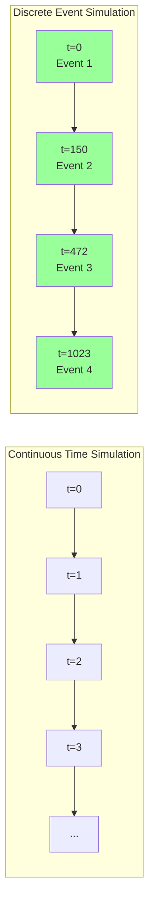
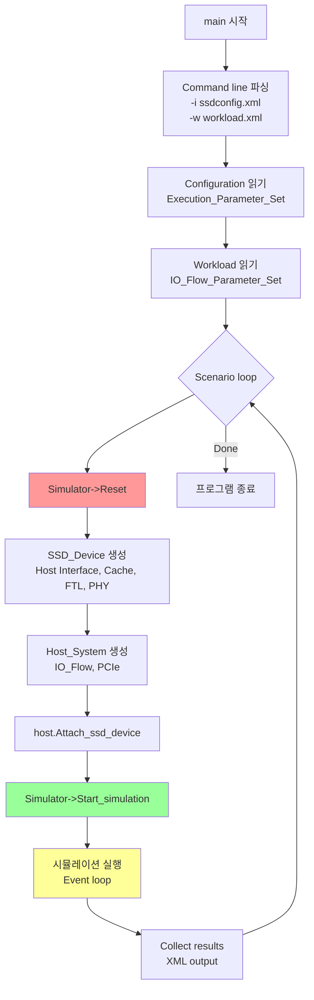
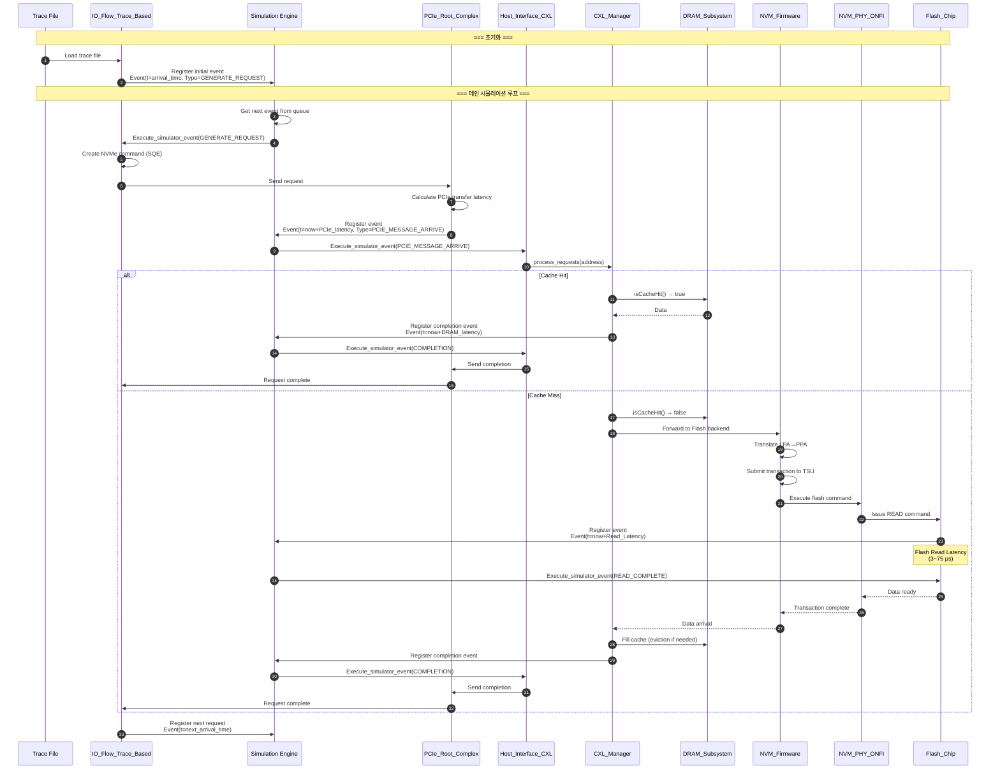
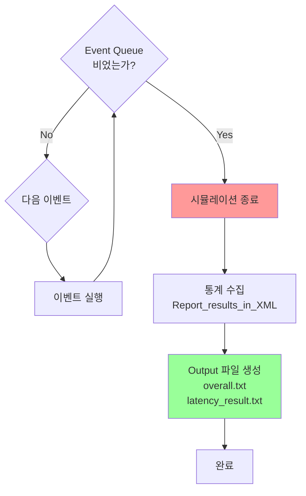

# Chapter 3: 시뮬레이션 흐름

[← Chapter 2](02-cxl-implementation.md) | [메인으로](../../DEVELOPER_GUIDE_KR.md) | [다음: Gem5 연동 →](04-gem5-integration.md)

---

## 목차
1. [Discrete Event Simulation 개요](#discrete-event-simulation-개요)
2. [Simulation Engine 구조](#simulation-engine-구조)
3. [초기화 과정](#초기화-과정)
4. [Request Processing Pipeline](#request-processing-pipeline)
5. [Event Scheduling 메커니즘](#event-scheduling-메커니즘)
6. [시뮬레이션 종료](#시뮬레이션-종료)

---

## Discrete Event Simulation 개요

### DES 기본 개념

**Discrete Event Simulation (DES)**은 시스템의 상태가 **이산적인 시점(event)**에만 변화하는 시뮬레이션 방식입니다.



### MQSim의 DES 특징

- **Time Unit**: nanosecond (uint64_t)
- **Event Queue**: Priority Queue (sorted by fire time)
- **Singleton Engine**: 전역적으로 하나의 시뮬레이션 엔진
- **Event-driven**: 모든 동작이 이벤트로 표현됨

---

## Simulation Engine 구조

### Engine 클래스 (Singleton)

**위치**: `src/sim/Engine.h:13-49`

```cpp
namespace MQSimEngine {
    class Engine {
    public:
        static Engine* Instance();  // Singleton pattern

        // 시뮬레이션 시간
        sim_time_type Time();

        // 이벤트 관리
        Sim_Event* Register_sim_event(sim_time_type fireTime,
                                       Sim_Object* targetObject,
                                       void* parameters = NULL,
                                       int type = 0);
        void Ignore_sim_event(Sim_Event*);

        // 객체 관리
        void AddObject(Sim_Object* obj);
        Sim_Object* GetObject(sim_object_id_type object_id);

        // 시뮬레이션 제어
        void Start_simulation();
        void Stop_simulation();
        void Reset();

    private:
        sim_time_type _sim_time;                          // 현재 시뮬레이션 시간
        EventTree* _EventList;                            // Event priority queue
        unordered_map<sim_object_id_type, Sim_Object*> _ObjectList;
        bool stop;
        bool started;
        static Engine* _instance;  // Singleton instance
    };
}

// 전역 매크로
#define Simulator MQSimEngine::Engine::Instance()
```

### EventTree - Priority Queue

**위치**: `src/sim/EventTree.h`

```cpp
class EventTree {
private:
    list<Sim_Event*> timeline;  // Sorted event list

public:
    void Insert(Sim_Event* ev);           // O(n) 삽입 (정렬 유지)
    Sim_Event* Get_next_event();          // O(1) 다음 이벤트 가져오기
    void Remove(Sim_Event* ev);           // 이벤트 제거
    bool Has_pending_events();            // 큐가 비었는지 확인
};
```

**시간 순 정렬**:
```
[Event 1: t=100ns] → [Event 2: t=100ns] → [Event 3: t=250ns] → [Event 4: t=1000ns]
      ↑ Next event to execute
```

### Sim_Event 구조

```cpp
class Sim_Event {
public:
    sim_time_type Fire_time;        // 이벤트 실행 시간 (ns)
    Sim_Object* Target_sim_object;  // 타겟 객체
    void* Parameters;               // 추가 파라미터
    int Type;                       // 이벤트 타입
};
```

### Sim_Object - 시뮬레이션 가능 객체

```cpp
class Sim_Object {
public:
    sim_object_id_type ID;  // Unique identifier

    // 이벤트 핸들러 (pure virtual)
    virtual void Execute_simulator_event(Sim_Event*) = 0;

    virtual void Start_simulation() {}
    virtual void Validate_simulation_config() {}
};
```

**상속 계층**:
```
Sim_Object
  ├── Host_Interface_Base
  │     ├── Host_Interface_CXL
  │     ├── Host_Interface_NVMe
  │     └── Host_Interface_SATA
  ├── NVM_Firmware
  ├── NVM_PHY_Base
  ├── Flash_Chip
  └── IO_Flow_Base
```

---

## 초기화 과정

### main() 함수 흐름

**위치**: `src/main.cpp:260-312`



### SSD_Device 생성

**위치**: `src/exec/SSD_Device.cpp`

```cpp
SSD_Device::SSD_Device(Device_Parameter_Set* parameters,
                       std::vector<IO_Flow_Parameter_Set*>* io_flows) {
    // 1. 채널 및 칩 생성
    for (unsigned int channel_id = 0; channel_id < Channel_count; channel_id++) {
        ONFI_Channel_NVDDR2* channel = new ONFI_Channel_NVDDR2(...);
        Channels.push_back(channel);

        for (unsigned int chip_id = 0; chip_id < Chip_no_per_channel; chip_id++) {
            Flash_Chip* chip = new Flash_Chip(...);
            channel->Attach_chip(chip);
        }
    }

    // 2. PHY 생성
    PHY = new NVM_PHY_ONFI_NVDDR2(..., &Channels);

    // 3. FTL 생성
    Firmware = new NVM_Firmware(...);
    Firmware->Instantiate_components(parameters);  // Address mapping, GC, TSU

    // 4. Data Cache 생성
    Cache_manager = new Data_Cache_Manager_Flash_Advanced(...);

    // 5. Host Interface 생성 (CXL 또는 NVMe)
    if (parameters->HostInterface_Type == HostInterface_Types::NVME) {
        if (USE_CXL) {
            CXL_DRAM_Model* cxl_dram = new CXL_DRAM_Model(...);
            Host_interface = new Host_Interface_CXL(..., Cache_manager, cxl_dram);
        } else {
            Host_interface = new Host_Interface_NVMe(..., Cache_manager);
        }
    }

    // 6. 컴포넌트 간 연결
    Cache_manager->Setup_triggers();
    Firmware->Attach_to_device(this);
    Host_interface->Attach_to_device(Cache_manager);
}
```

### Host_System 생성

```cpp
Host_System::Host_System(Host_Parameter_Set* parameters, bool preconditioning,
                         Host_Interface_Base* ssd_host_interface) {
    // 1. PCIe Root Complex 생성
    PCIe_root_complex = new PCIe_Root_Complex(...);

    // 2. PCIe Switch 생성
    PCIe_switch = new PCIe_Switch(...);
    PCIe_root_complex->Attach_switch(PCIe_switch);

    // 3. IO Flow 생성 (trace-based or synthetic)
    for (auto& flow_def : parameters->IO_Flow_Definitions) {
        IO_Flow_Base* io_flow;

        if (flow_def->Type == Flow_Type::TRACE) {
            io_flow = new IO_Flow_Trace_Based(...);
        } else {
            io_flow = new IO_Flow_Synthetic(...);
        }

        IO_flows.push_back(io_flow);
        PCIe_root_complex->Attach_io_flow(io_flow);
    }

    // 4. SSD attach
    PCIe_switch->Attach_ssd_device(ssd_host_interface);
}
```

---

## Request Processing Pipeline

### 전체 흐름 (Read Request)



### 상세 Event Types

| 컴포넌트 | Event Type | 설명 |
|---------|------------|------|
| **IO_Flow** | GENERATE_REQUEST | 다음 I/O 요청 생성 |
| **PCIe** | PCIE_MESSAGE_ARRIVE | PCIe 메시지 도착 |
| **Host_Interface** | USER_REQUEST_ARRIVED | 사용자 요청 수신 |
| **Host_Interface** | USER_MEMORY_TRANSACTION_SERVICED | 메모리 트랜잭션 완료 |
| **Data_Cache** | MEMORY_READ_FOR_USERIO_FINISHED | 캐시 읽기 완료 |
| **FTL** | TRANSACTION_SERVICED_SIGNAL | 트랜잭션 서비스 완료 |
| **TSU** | SCHEDULE | 트랜잭션 스케줄링 |
| **Flash_Chip** | READ_CMD_LAUNCHED | READ 명령 시작 |
| **Flash_Chip** | PROGRAM_CMD_LAUNCHED | PROGRAM 명령 시작 |
| **Flash_Chip** | ERASE_CMD_LAUNCHED | ERASE 명령 시작 |

---

## Event Scheduling 메커니즘

### Register_sim_event() 동작

```cpp
// src/sim/Engine.cpp (simplified)

Sim_Event* Engine::Register_sim_event(sim_time_type fireTime,
                                        Sim_Object* targetObject,
                                        void* parameters,
                                        int type) {
    // 1. 이벤트 생성
    Sim_Event* ev = new Sim_Event;
    ev->Fire_time = fireTime;
    ev->Target_sim_object = targetObject;
    ev->Parameters = parameters;
    ev->Type = type;

    // 2. Event Queue에 삽입 (정렬 유지)
    _EventList->Insert(ev);

    return ev;
}
```

### Start_simulation() - 메인 루프

```cpp
// src/sim/Engine.cpp

void Engine::Start_simulation() {
    started = true;

    // 1. 모든 객체 초기화
    for (auto& obj : _ObjectList) {
        obj.second->Start_simulation();
    }

    // 2. 메인 이벤트 루프
    while (!stop && _EventList->Has_pending_events()) {
        // 2.1 다음 이벤트 가져오기
        Sim_Event* ev = _EventList->Get_next_event();

        // 2.2 시뮬레이션 시간 업데이트
        _sim_time = ev->Fire_time;

        // 2.3 이벤트 실행
        ev->Target_sim_object->Execute_simulator_event(ev);

        // 2.4 이벤트 메모리 해제
        delete ev;
    }

    // 3. 통계 수집
    PRINT_MESSAGE("Simulation finished at time " << _sim_time << " ns");
}
```

### Event Queue 동작 예시

```
시뮬레이션 시작: t=0

Initial Events:
  [t=0, IO_Flow: GENERATE_REQUEST]
  [t=100, IO_Flow: GENERATE_REQUEST]
  [t=200, IO_Flow: GENERATE_REQUEST]

==== t=0 ====
Execute: IO_Flow::GENERATE_REQUEST
  → PCIe latency 계산 (50ns)
  → Register event: [t=50, Host_Interface: PCIE_MESSAGE_ARRIVE]

Event Queue:
  [t=50, Host_Interface: PCIE_MESSAGE_ARRIVE]
  [t=100, IO_Flow: GENERATE_REQUEST]
  [t=200, IO_Flow: GENERATE_REQUEST]

==== t=50 ====
Execute: Host_Interface::PCIE_MESSAGE_ARRIVE
  → Cache miss → Flash read 필요
  → Flash latency 3000ns
  → Register event: [t=3050, Flash_Chip: READ_COMPLETE]

Event Queue:
  [t=100, IO_Flow: GENERATE_REQUEST]
  [t=200, IO_Flow: GENERATE_REQUEST]
  [t=3050, Flash_Chip: READ_COMPLETE]

==== t=100 ====
Execute: IO_Flow::GENERATE_REQUEST
  ... (similar)

==== t=3050 ====
Execute: Flash_Chip::READ_COMPLETE
  → Data to CXL_Manager
  → Fill cache
  → Register event: [t=3100, Host_Interface: COMPLETION]

...
```

---

## Request Processing Pipeline 상세

### 1. IO_Flow_Trace_Based: Request 생성

```cpp
// src/host/IO_Flow_Trace_Based.cpp (pseudo-code)

void IO_Flow_Trace_Based::Execute_simulator_event(Sim_Event* event) {
    if (event->Type == GENERATE_NEXT_REQUEST) {
        // 1. Trace 파일에서 읽기
        Trace_Entry entry = read_next_trace_line();

        // 2. NVMe command 생성
        Submission_Queue_Entry* sqe = new Submission_Queue_Entry;
        sqe->Opcode = (entry.is_read) ? NVME_READ_OPCODE : NVME_WRITE_OPCODE;
        sqe->Command_specific[0] = entry.lba;
        sqe->Command_specific[2] = entry.size;

        // 3. PCIe로 전송
        root_complex->Send_request_to_device(sqe, this);

        // 4. 다음 요청 스케줄
        if (has_more_requests()) {
            Trace_Entry next = peek_next_trace_line();
            Simulator->Register_sim_event(next.arrival_time, this, NULL, GENERATE_NEXT_REQUEST);
        }
    }
}
```

### 2. PCIe_Root_Complex: 전송

```cpp
void PCIe_Root_Complex::Send_request_to_device(Submission_Queue_Entry* sqe,
                                                IO_Flow_Base* source) {
    // PCIe latency 계산
    uint64_t transfer_time = calculate_pcie_latency(sizeof(Submission_Queue_Entry));

    // PCIe_Message 생성
    PCIe_Message* message = new PCIe_Message;
    message->Type = PCIe_Message_Type::WRITE_REQ;
    message->Payload = sqe;
    message->Payload_size = sizeof(Submission_Queue_Entry);
    message->Source = source;

    // 전송 이벤트 스케줄
    Simulator->Register_sim_event(Simulator->Time() + transfer_time,
                                   pcie_switch, message, 0);
}
```

### 3. Host_Interface_CXL: 수신 및 처리

```cpp
void Host_Interface_CXL::Execute_simulator_event(Sim_Event* event) {
    if (event->Type == USER_REQUEST_ARRIVED) {
        PCIe_Message* message = (PCIe_Message*)event->Parameters;

        // CXL Manager에서 처리
        bool need_flash = cxl_man->process_requests(message->Address,
                                                      message->Payload, 0);

        if (!need_flash) {
            // Cache hit - 즉시 완료
            send_completion_to_host(message);
        } else {
            // Cache miss - Flash backend로 전달
            forward_to_flash_backend(message);
        }
    }
}
```

### 4. NVM_Firmware (FTL): Address Translation

```cpp
void NVM_Firmware::Process_transaction(NVM_Transaction_Flash* transaction) {
    // 1. Logical → Physical 주소 변환
    PPA_type ppa = address_mapping_unit->Translate_lpa_to_ppa(transaction->LPA);

    // 2. GC 필요 여부 체크
    if (gc_and_wl_unit->GC_is_in_urgent_mode(transaction->Stream_id)) {
        // GC 실행
        gc_and_wl_unit->Check_gc_required(transaction);
    }

    // 3. TSU에 제출
    tsu->Submit_transaction(transaction);
}
```

### 5. TSU (Transaction Scheduling Unit): 스케줄링

```cpp
void TSU_OutofOrder::Submit_transaction(NVM_Transaction_Flash* transaction) {
    // 적절한 큐에 추가
    Flash_Transaction_Queue* queue = get_queue(transaction);
    queue->push_back(transaction);

    // 스케줄링 이벤트 등록
    Simulator->Register_sim_event(Simulator->Time() + 1,
                                   this, NULL, SCHEDULE);
}

void TSU_OutofOrder::Execute_simulator_event(Sim_Event* event) {
    if (event->Type == SCHEDULE) {
        // 1. 각 큐에서 실행 가능한 트랜잭션 선택
        NVM_Transaction_Flash* selected = schedule_transaction();

        if (selected != NULL) {
            // 2. PHY로 전달
            phy->Execute_transaction(selected);
        }

        // 3. 다음 스케줄링
        if (has_pending_transactions()) {
            Simulator->Register_sim_event(Simulator->Time() + SCHEDULE_INTERVAL,
                                           this, NULL, SCHEDULE);
        }
    }
}
```

### 6. Flash_Chip: Command 실행

```cpp
void Flash_Chip::Execute_simulator_event(Sim_Event* event) {
    if (event->Type == READ_CMD_LAUNCHED) {
        NVM_Transaction_Flash_RD* read_tr = (NVM_Transaction_Flash_RD*)event->Parameters;

        // Flash read latency
        sim_time_type read_latency = get_read_latency(read_tr->Address.PageID);

        // 완료 이벤트 스케줄
        Simulator->Register_sim_event(Simulator->Time() + read_latency,
                                       this, read_tr, READ_CMD_FINISHED);
    }
    else if (event->Type == READ_CMD_FINISHED) {
        NVM_Transaction_Flash_RD* read_tr = (NVM_Transaction_Flash_RD*)event->Parameters;

        // Data ready - 상위 레이어로 전달
        broadcast_transaction_serviced_signal(read_tr);
    }
}
```

---

## 시뮬레이션 종료

### 종료 조건



### 통계 수집

```cpp
// src/main.cpp:231-251

void collect_results(SSD_Device& ssd, Host_System& host, const char* output_file_path) {
    // XML writer 생성
    Utils::XmlWriter xmlwriter;
    xmlwriter.Open(output_file_path);

    std::string tmp("MQSim_Results");
    xmlwriter.Write_open_tag(tmp);

    // Host 통계
    host.Report_results_in_XML("", xmlwriter);

    // SSD 통계
    ssd.Report_results_in_XML("", xmlwriter);

    xmlwriter.Write_close_tag();
    xmlwriter.Close();

    // 콘솔 출력
    std::vector<Host_Components::IO_Flow_Base*> IO_flows = host.Get_io_flows();
    for (auto& flow : IO_flows) {
        cout << "Flow " << flow->ID()
             << " - total requests: " << flow->Get_generated_request_count()
             << " serviced: " << flow->Get_serviced_request_count() << endl;
        cout << "  Response time: " << flow->Get_device_response_time() << " us" << endl;
    }
}
```

### Host_Interface_CXL 통계 출력

```cpp
// src/cxl/Host_Interface_CXL.cpp (simplified)

void Host_Interface_CXL::Report_results_in_XML(string name_prefix, Utils::XmlWriter& xmlwriter) {
    // CXL Manager 통계
    xmlwriter.Write_attribute("Cache_Hit_Count", cxl_man->cache_hit_count);
    xmlwriter.Write_attribute("Cache_Miss_Count", cxl_man->cache_miss_count);

    // Hit rate 계산
    double hit_rate = (double)cxl_man->cache_hit_count /
                      (cxl_man->cache_hit_count + cxl_man->cache_miss_count);
    xmlwriter.Write_attribute("Cache_Hit_Rate", hit_rate);

    // Prefetch 통계
    xmlwriter.Write_attribute("Prefetch_Hit_Count", cxl_man->prefetch_hit_count);
    xmlwriter.Write_attribute("Prefetch_Coverage", calculate_coverage());
    xmlwriter.Write_attribute("Prefetch_Accuracy", calculate_accuracy());

    // Flash 접근
    xmlwriter.Write_attribute("Flash_Read_Count", cxl_man->flash_read_count);
    xmlwriter.Write_attribute("Flush_Count", cxl_man->flush_count);
}
```

---

## 성능 고려사항

### Event Queue Complexity

| Operation | Complexity | 설명 |
|-----------|------------|------|
| Insert Event | O(n) | Sorted insertion |
| Get Next Event | O(1) | Head of queue |
| Total Events | ~10^6 - 10^8 | 20M requests × 5-10 events per request |

### 시뮬레이션 시간 vs Real Time

```
Workload: 20M requests
Simulation time: ~50 seconds (application runtime)

Real execution time on PC:
  - Small config: 5-30 minutes
  - Large config: 1-2 hours

→ Slowdown: ~100-1000x
```

---

## 다음 챕터

이제 Gem5와의 연동 방법을 살펴보겠습니다.

[다음: Chapter 4 - Gem5 연동 가이드 →](04-gem5-integration.md)

---

[← Chapter 2](02-cxl-implementation.md) | [메인으로](../../DEVELOPER_GUIDE_KR.md)
