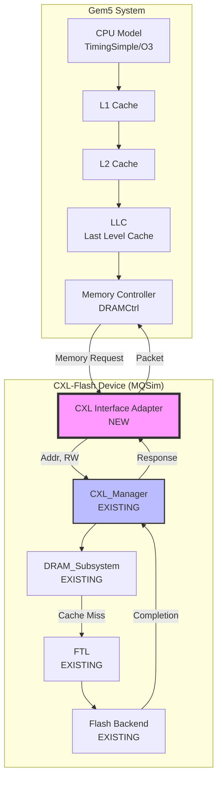
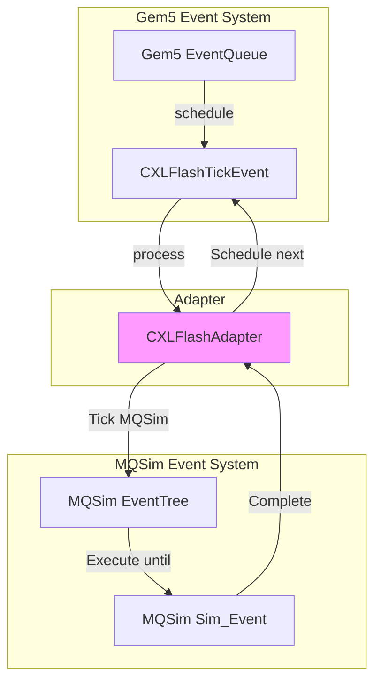
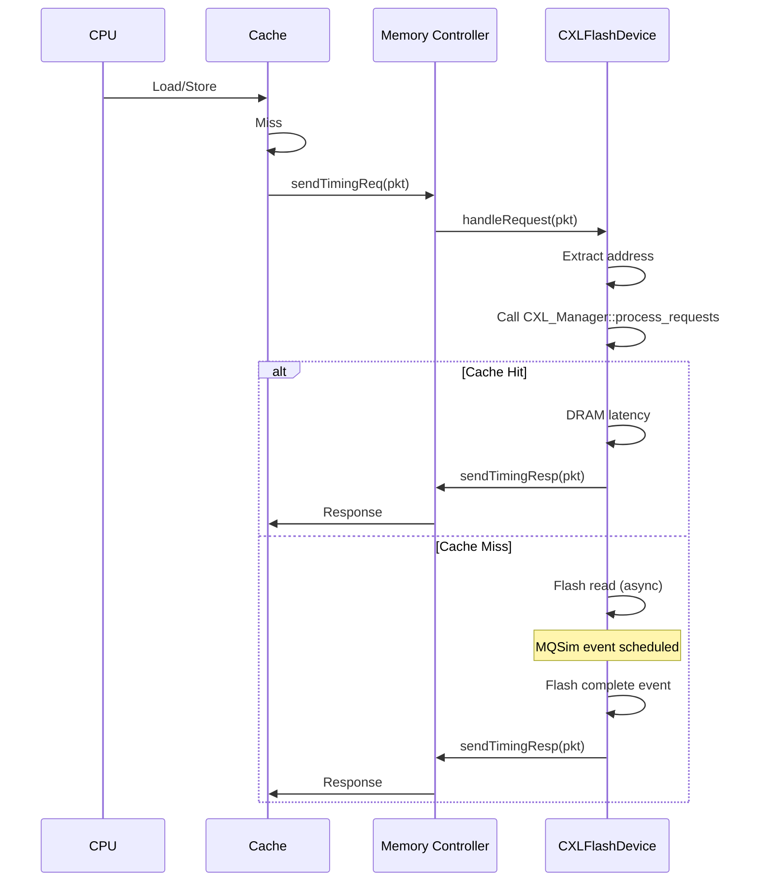

# Chapter 4: Gem5 연동 가이드

[← Chapter 3](03-simulation-flow.md) | [메인으로](../../DEVELOPER_GUIDE_KR.md)

---

## 목차
1. [연동 전략 개요](#연동-전략-개요)
2. [Architecture 설계](#architecture-설계)
3. [Event System 통합](#event-system-통합)
4. [Memory Controller 연동](#memory-controller-연동)
5. [구현 가이드](#구현-가이드)
6. [예제 코드](#예제-코드)
7. [성능 고려사항](#성능-고려사항)

---

## 연동 전략 개요

### 목표
MQSim_CXL을 **Gem5의 CXL Traffic Generator**로 활용하여, Gem5에서 실행되는 애플리케이션의 메모리 접근을 CXL-Flash 디바이스로 시뮬레이션합니다.

### 핵심 아이디어



### 주요 과제

| 과제 | MQSim | Gem5 | 해결 방법 |
|-----|--------|------|----------|
| **Event System** | Discrete Event (DES) | Discrete Event (EventQueue) | Event 동기화 레이어 |
| **Time Unit** | nanosecond (uint64_t) | Tick (uint64_t) | Tick ↔ ns 변환 |
| **Memory Interface** | PCIe_Message | Packet (Request/Response) | Packet Adapter |
| **Address Space** | LBA (Logical Block Address) | Physical Address | Address Translation |
| **Initialization** | Standalone | SimObject hierarchy | Config script integration |

---

## Architecture 설계

### Design Option 1: Tight Integration (권장)

**MQSim을 Gem5 SimObject로 통합**

```
gem5/src/mem/cxl_flash/
├── CXLFlashDevice.py         # Python config
├── CXLFlashDevice.hh/cc      # SimObject wrapper
├── CXLFlashAdapter.hh/cc     # Event/Packet adapter
└── mqsim/                    # MQSim 소스 복사
    ├── cxl/
    ├── ssd/
    └── ...
```

**장점**:
- Gem5 event system과 완전히 통합
- Configuration이 Gem5 스타일로 통일
- 디버깅 및 프로파일링 용이

**단점**:
- MQSim 코드 수정 필요
- 빌드 복잡도 증가

### Design Option 2: Loose Coupling

**MQSim을 별도 프로세스로 실행하고 IPC로 통신**

```
┌─────────────┐         ┌──────────────┐
│   Gem5      │  Unix   │  MQSim_CXL   │
│             │ Socket  │              │
│  MemCtrl ──────────────→ CXL_Manager │
│             │  ←─────────             │
└─────────────┘         └──────────────┘
```

**장점**:
- MQSim 코드 수정 최소화
- 독립적인 개발 및 디버깅

**단점**:
- IPC 오버헤드
- Event 동기화 복잡
- 성능 저하

### 권장: Option 1 (Tight Integration)

이하 가이드는 **Tight Integration** 방식을 기준으로 작성되었습니다.

---

## Event System 통합

### MQSim의 Discrete Event Simulation

```cpp
// MQSim의 이벤트 스케줄링
Simulator->Register_sim_event(fire_time,  // nanosecond
                               target_object,
                               parameters,
                               type);

// 메인 루프
while (has_events()) {
    Sim_Event* ev = get_next_event();
    _sim_time = ev->Fire_time;
    ev->Target_sim_object->Execute_simulator_event(ev);
}
```

### Gem5의 Event System

```cpp
// Gem5의 이벤트 스케줄링
schedule(event, curTick() + delay_ticks);

// EventQueue (자동 실행)
class Event {
    virtual void process() = 0;  // 이벤트 핸들러
};
```

### 통합 전략: Hybrid Approach



### 구현: CXLFlashAdapter

```cpp
// gem5/src/mem/cxl_flash/CXLFlashAdapter.hh

class CXLFlashAdapter {
private:
    // MQSim components
    SSD_Device* ssd_device;
    Host_System* host_system;

    // Gem5 integration
    EventFunctionWrapper tickEvent;
    Tick nextEventTick;

public:
    CXLFlashAdapter(const Params& p);

    // Gem5 → MQSim
    void handleRequest(PacketPtr pkt);

    // MQSim tick
    void tick();

    // MQSim → Gem5
    void sendResponse(PacketPtr pkt);
};

// Constructor
CXLFlashAdapter::CXLFlashAdapter(const Params& p)
    : tickEvent([this]{ tick(); }, name())
{
    // MQSim 초기화
    Device_Parameter_Set* dev_params = load_ssd_config(p.ssd_config_file);
    ssd_device = new SSD_Device(dev_params, ...);
    host_system = new Host_System(...);

    // Gem5 event 스케줄
    schedule(tickEvent, curTick() + 1);
}

// MQSim을 주기적으로 tick
void CXLFlashAdapter::tick() {
    // MQSim 이벤트 실행 (time-bound)
    sim_time_type current_time = curTick();  // Gem5 tick
    sim_time_type target_time = current_time + 1000;  // 1 μs 단위로 실행

    // MQSim 내부 이벤트 처리
    while (Simulator->Has_pending_events() &&
           Simulator->Next_event_time() <= target_time) {
        Simulator->Execute_next_event();
    }

    // 다음 tick 스케줄
    if (Simulator->Has_pending_events()) {
        Tick next_tick = Simulator->Next_event_time();
        schedule(tickEvent, next_tick);
    }
}
```

---

## Memory Controller 연동

### Gem5 Memory Request 흐름



### CXLFlashDevice SimObject

```cpp
// gem5/src/mem/cxl_flash/CXLFlashDevice.hh

class CXLFlashDevice : public SimObject
{
private:
    // Gem5 ports
    class MemSidePort : public ResponsePort {
        CXLFlashDevice* owner;
    public:
        bool recvTimingReq(PacketPtr pkt) override;
        void recvRespRetry() override;
        Tick recvAtomic(PacketPtr pkt) override;
        void recvFunctional(PacketPtr pkt) override;
    };

    MemSidePort mem_side_port;

    // MQSim adapter
    CXLFlashAdapter* mqsim_adapter;

    // Pending requests
    std::map<Addr, PacketPtr> pendingRequests;

public:
    CXLFlashDevice(const Params& p);

    Port& getPort(const std::string &if_name, PortID idx) override;

    // Request handling
    bool handleRequest(PacketPtr pkt);
    void handleResponse(Addr addr, uint64_t latency_ns);
};

// Request handler
bool CXLFlashDevice::handleRequest(PacketPtr pkt) {
    // 1. Extract address and size
    Addr addr = pkt->getAddr();
    unsigned size = pkt->getSize();
    bool is_read = pkt->isRead();

    // 2. Store packet for later response
    pendingRequests[addr] = pkt;

    // 3. Forward to MQSim
    bool need_flash = mqsim_adapter->process_cxl_request(
        addr,
        size,
        is_read
    );

    if (!need_flash) {
        // Cache hit - immediate response
        schedule_response(pkt, DRAM_LATENCY);
        return true;
    }

    // Cache miss - will respond later via MQSim event
    return true;
}

// Response from MQSim
void CXLFlashDevice::handleResponse(Addr addr, uint64_t latency_ns) {
    // 1. Find pending packet
    auto it = pendingRequests.find(addr);
    if (it == pendingRequests.end()) {
        panic("Response for unknown address");
    }

    PacketPtr pkt = it->second;
    pendingRequests.erase(it);

    // 2. Convert latency to ticks
    Tick latency_ticks = SimClock::Int::ns * latency_ns;

    // 3. Send response
    mem_side_port.schedTimingResp(pkt, curTick() + latency_ticks);
}
```

---

## 구현 가이드

### Step 1: MQSim 코드 준비

```bash
# Gem5 소스 디렉토리
cd gem5/src/mem

# CXL Flash 디렉토리 생성
mkdir cxl_flash
cd cxl_flash

# MQSim 소스 복사
cp -r /path/to/MQSim_CXL/src/* mqsim/

# 불필요한 파일 제거
rm mqsim/main.cpp  # Gem5에서 entry point 불필요
```

### Step 2: MQSim Engine 수정

MQSim의 `Engine`을 Gem5에서 제어 가능하도록 수정합니다.

```cpp
// mqsim/sim/Engine.h (수정)

class Engine {
public:
    // 기존 함수
    void Start_simulation();  // 전체 시뮬레이션 실행 (standalone용)

    // 새로 추가: Gem5 통합용
    bool Has_pending_events() const;
    sim_time_type Next_event_time() const;
    void Execute_next_event();  // 단일 이벤트 실행

    // Gem5로부터 호출
    void Set_external_time(sim_time_type external_time);
};

// mqsim/sim/Engine.cpp (추가)

bool Engine::Has_pending_events() const {
    return _EventList->Has_pending_events();
}

sim_time_type Engine::Next_event_time() const {
    Sim_Event* next_ev = _EventList->Peek_next_event();
    return next_ev ? next_ev->Fire_time : UINT64_MAX;
}

void Engine::Execute_next_event() {
    if (!Has_pending_events()) return;

    Sim_Event* ev = _EventList->Get_next_event();
    _sim_time = ev->Fire_time;
    ev->Target_sim_object->Execute_simulator_event(ev);
    delete ev;
}

void Engine::Set_external_time(sim_time_type external_time) {
    _sim_time = external_time;
}
```

### Step 3: CXL Interface Adapter 구현

```cpp
// gem5/src/mem/cxl_flash/CXLInterfaceAdapter.hh

class CXLInterfaceAdapter {
public:
    // Gem5 → MQSim
    bool process_cxl_request(Addr addr, unsigned size, bool is_read,
                             std::function<void(uint64_t)> callback);

    // MQSim → Gem5 callback 등록
    void register_completion_callback(Addr addr,
                                      std::function<void(uint64_t)> callback);

private:
    SSD_Components::Host_Interface_CXL* cxl_host_interface;
    SSD_Components::CXL_Manager* cxl_manager;

    // Pending callbacks
    std::map<Addr, std::function<void(uint64_t)>> callbacks;
};

// Implementation
bool CXLInterfaceAdapter::process_cxl_request(Addr addr, unsigned size,
                                                bool is_read,
                                                std::function<void(uint64_t)> callback) {
    // 1. Convert Gem5 address to LBA
    uint64_t lba = addr / 4096;  // 4KB page

    // 2. Create NVMe command (pseudo-packet)
    Submission_Queue_Entry* sqe = new Submission_Queue_Entry;
    sqe->Opcode = is_read ? NVME_READ_OPCODE : NVME_WRITE_OPCODE;
    sqe->Command_specific[0] = (uint32_t)(lba * 4096);
    sqe->Command_specific[1] = (uint32_t)((lba * 4096) >> 32);
    sqe->Command_specific[2] = ((uint32_t)((uint16_t)(size / 512))) & 0x0000ffff;

    // 3. Call CXL_Manager
    bool need_flash = cxl_manager->process_requests(addr, sqe, false);

    if (!need_flash) {
        // Cache hit - immediate callback
        callback(DRAM_LATENCY_NS);
        delete sqe;
        return false;
    }

    // 4. Cache miss - register callback
    callbacks[addr] = callback;

    // 5. Forward to Flash backend (trigger MQSim events)
    cxl_host_interface->Consume_pcie_message(create_pcie_message(sqe));

    return true;
}
```

### Step 4: Request Completion Handling

MQSim의 completion 이벤트를 intercept하여 Gem5로 콜백합니다.

```cpp
// Modify Host_Interface_CXL.cpp

void Host_Interface_CXL::request_completed(User_Request* request) {
    // 기존 completion 로직
    ...

    // Gem5 콜백 (NEW)
    if (gem5_adapter != nullptr) {
        uint64_t latency = Simulator->Time() - request->Arrival_time;
        gem5_adapter->notify_completion(request->Start_LBA * 4096, latency);
    }
}

// CXLInterfaceAdapter.cc

void CXLInterfaceAdapter::notify_completion(Addr addr, uint64_t latency_ns) {
    auto it = callbacks.find(addr);
    if (it != callbacks.end()) {
        // Gem5 콜백 실행
        it->second(latency_ns);
        callbacks.erase(it);
    }
}
```

### Step 5: Gem5 Configuration Script

```python
# configs/example/cxl_flash_test.py

import m5
from m5.objects import *

# CPU 생성
cpu = TimingSimpleCPU()

# CXL-Flash Device 생성
cxl_flash = CXLFlashDevice()
cxl_flash.ssd_config_file = "configs/cxl_flash/ssdconfig.xml"
cxl_flash.cxl_config_file = "configs/cxl_flash/config.txt"
cxl_flash.dram_size = 64 * 1024 * 1024  # 64 MB
cxl_flash.cache_policy = "CFLRU"
cxl_flash.prefetcher = "Best-offset"

# Memory Controller
mem_ctrl = MemCtrl()
mem_ctrl.dram = DDR4_2400_16x4()

# System 연결
system = System()
system.cpu = cpu
system.cxl_flash = cxl_flash
system.mem_ctrl = mem_ctrl

# Port 연결
cpu.icache_port = system.membus.cpu_side_ports
cpu.dcache_port = system.membus.cpu_side_ports
system.membus.mem_side_ports = cxl_flash.mem_side_port
cxl_flash.flash_side_port = mem_ctrl.port

# Workload
process = Process()
process.cmd = ['tests/test-progs/memory-intensive/mm']
cpu.workload = process
cpu.createThreads()

# Root 및 시뮬레이션
root = Root(full_system=False, system=system)
m5.instantiate()
m5.simulate()
```

---

## 예제 코드

### 완전한 CXLFlashDevice 구현

```cpp
// gem5/src/mem/cxl_flash/CXLFlashDevice.cc

#include "mem/cxl_flash/CXLFlashDevice.hh"
#include "mqsim/exec/SSD_Device.h"
#include "mqsim/cxl/Host_Interface_CXL.h"

CXLFlashDevice::CXLFlashDevice(const Params& p)
    : SimObject(p),
      mem_side_port(name() + ".mem_side_port", this),
      tickEvent([this]{ processTick(); }, name())
{
    // 1. Load MQSim configuration
    Execution_Parameter_Set* exec_params = new Execution_Parameter_Set;
    read_configuration_parameters(p.ssd_config_file, exec_params);

    // 2. CXL configuration
    cxl_config.readConfigFile(p.cxl_config_file);

    // 3. Create SSD Device
    std::vector<IO_Flow_Parameter_Set*> empty_flows;
    ssd_device = new SSD_Device(&exec_params->SSD_Device_Configuration,
                                 &empty_flows);

    // 4. Get CXL Manager
    auto* cxl_hi = dynamic_cast<SSD_Components::Host_Interface_CXL*>(
        ssd_device->Host_interface);
    if (cxl_hi == nullptr) {
        panic("Host interface is not CXL type");
    }
    cxl_manager = cxl_hi->cxl_man;

    // 5. Setup Gem5 callback
    cxl_hi->set_gem5_callback(
        std::bind(&CXLFlashDevice::handleMQSimCompletion, this,
                  std::placeholders::_1, std::placeholders::_2));

    // 6. Start periodic tick
    schedule(tickEvent, curTick() + p.tick_interval);

    DPRINTF(CXLFlash, "CXLFlashDevice initialized\n");
}

bool CXLFlashDevice::MemSidePort::recvTimingReq(PacketPtr pkt) {
    return owner->handleRequest(pkt);
}

bool CXLFlashDevice::handleRequest(PacketPtr pkt) {
    Addr addr = pkt->getAddr();
    bool is_read = pkt->isRead();

    DPRINTF(CXLFlash, "Request: addr=%#x, size=%d, %s\n",
            addr, pkt->getSize(), is_read ? "read" : "write");

    // Convert address to LBA
    uint64_t lba = addr / 4096;

    // Call CXL Manager
    Submission_Queue_Entry* sqe = create_sqe(lba, pkt->getSize(), is_read);
    bool need_flash = cxl_manager->process_requests(addr, sqe, false);

    // Store pending packet
    pendingRequests[addr] = pkt;

    if (!need_flash) {
        // Cache hit - schedule immediate response
        Tick latency = DRAM_LATENCY_TICKS;
        schedule_response_event(addr, latency);
    }
    // else: Flash miss - will be handled by MQSim completion callback

    return true;
}

void CXLFlashDevice::handleMQSimCompletion(uint64_t addr, uint64_t latency_ns) {
    DPRINTF(CXLFlash, "Completion: addr=%#x, latency=%llu ns\n",
            addr, latency_ns);

    // Convert to ticks
    Tick latency_ticks = SimClock::Int::ns * latency_ns;

    // Schedule response
    schedule_response_event(addr, latency_ticks);
}

void CXLFlashDevice::schedule_response_event(Addr addr, Tick latency) {
    auto it = pendingRequests.find(addr);
    if (it == pendingRequests.end()) {
        warn("Response for unknown address %#x", addr);
        return;
    }

    PacketPtr pkt = it->second;

    // Set response
    pkt->makeResponse();

    // Send via port
    mem_side_port.schedTimingResp(pkt, curTick() + latency);

    // Remove from pending
    pendingRequests.erase(it);
}

void CXLFlashDevice::processTick() {
    // Execute MQSim events up to current time
    sim_time_type current_ns = curTick() / SimClock::Int::ns;

    // Sync MQSim time
    MQSimEngine::Engine::Instance()->Set_external_time(current_ns);

    // Execute pending events
    while (MQSimEngine::Engine::Instance()->Has_pending_events()) {
        sim_time_type next_time = MQSimEngine::Engine::Instance()->Next_event_time();

        if (next_time > current_ns + 1000) {  // 1 μs window
            break;
        }

        MQSimEngine::Engine::Instance()->Execute_next_event();
    }

    // Schedule next tick
    schedule(tickEvent, curTick() + tickInterval);
}

// Python config
CXLFlashDevice*
CXLFlashDeviceParams::create() const {
    return new CXLFlashDevice(this);
}
```

### Python Configuration

```python
# gem5/src/mem/cxl_flash/CXLFlashDevice.py

from m5.params import *
from m5.SimObject import SimObject

class CXLFlashDevice(SimObject):
    type = 'CXLFlashDevice'
    cxx_header = "mem/cxl_flash/CXLFlashDevice.hh"
    cxx_class = "gem5::CXLFlashDevice"

    # Ports
    mem_side_port = ResponsePort("Memory side port")

    # Configuration files
    ssd_config_file = Param.String("Path to ssdconfig.xml")
    cxl_config_file = Param.String("config.txt", "Path to CXL config")

    # CXL parameters
    dram_size = Param.MemorySize("64MB", "Device DRAM cache size")
    cache_policy = Param.String("CFLRU", "Cache replacement policy")
    prefetcher = Param.String("Best-offset", "Prefetcher algorithm")
    has_mshr = Param.Bool(True, "Enable MSHR")
    set_associativity = Param.Int(16, "Cache set associativity")

    # Timing
    tick_interval = Param.Latency('1us', "MQSim tick interval")
```

---

## 성능 고려사항

### 1. Event Synchronization Overhead

```
Gem5 Event → MQSim Adapter → MQSim Event Queue → Execute → Callback → Gem5 Event

Overhead per request: ~5-10 μs (host simulation time)
```

**최적화**:
- Batch event execution (1 μs 단위로 묶어서 실행)
- Event pooling (재사용)

### 2. Address Translation

```cpp
// 빠른 address translation
inline uint64_t addr_to_lba(Addr addr) {
    return addr >> 12;  // / 4096
}

inline Addr lba_to_addr(uint64_t lba) {
    return lba << 12;   // * 4096
}
```

### 3. Cache Coherence

Gem5의 cache와 CXL-Flash의 DRAM cache는 별개입니다.

```
┌──────────────────┐
│  Gem5 L1/L2/LLC  │  ← Gem5 cache hierarchy
└────────┬─────────┘
         │
┌────────▼─────────┐
│  CXL DRAM Cache  │  ← MQSim device cache
└────────┬─────────┘
         │
┌────────▼─────────┐
│  Flash Storage   │
└──────────────────┘
```

**주의**: Gem5 cache와 CXL cache 간 coherence 없음 (intended)

---

## 검증 및 테스트

### Unit Test

```cpp
// gem5/src/mem/cxl_flash/test/test_cxl_flash.cc

TEST(CXLFlashDevice, BasicRead) {
    // Setup
    CXLFlashDevice dev(...);

    // Create read request
    Request req(0x0, 64, 0);
    Packet pkt(&req, MemCmd::ReadReq);

    // Send request
    bool accepted = dev.handleRequest(&pkt);
    EXPECT_TRUE(accepted);

    // Wait for response
    // ... (event-driven test framework)

    // Verify latency
    EXPECT_LT(latency, 1000000);  // < 1 ms
}
```

### Integration Test

```python
# tests/gem5/cxl_flash/test_basic.py

def test_cxl_flash_basic():
    """Test basic CXL-Flash functionality"""

    # Create system with CXL-Flash
    system = create_system_with_cxl_flash()

    # Run simple memory test
    system.workload = 'tests/test-progs/mem-test'

    # Simulate
    simulator = Simulator(system)
    simulator.run()

    # Check statistics
    stats = simulator.get_stats()
    assert stats['cxl_flash.cache_hit_rate'] > 0.8
    assert stats['cxl_flash.avg_latency'] < 1000  # < 1 μs
```

---

## 추가 개선 사항

### 1. Multiple CXL Devices

```python
# 여러 CXL-Flash 디바이스 지원
system.cxl_flash0 = CXLFlashDevice(...)
system.cxl_flash1 = CXLFlashDevice(...)

# Address interleaving
system.mem_ctrl.interleave_bits = 12  # 4KB granularity
```

### 2. CXL.cache Protocol

현재 구현은 CXL.mem만 지원합니다. CXL.cache (device-initiated cache ops) 추가 가능:

```cpp
class CXLFlashDevice {
    // Device → Host cache snooping
    void snoop_host_cache(Addr addr);

    // Device-initiated invalidation
    void invalidate_host_cache_line(Addr addr);
};
```

### 3. Thermal Modeling

```cpp
class CXLFlashDevice {
    ThermalModel* thermal_model;

    void update_temperature() {
        double power = calculate_power();
        thermal_model->update(power);

        if (thermal_model->get_temperature() > THROTTLE_TEMP) {
            enable_throttling();
        }
    }
};
```

---

## 결론

MQSim_CXL을 Gem5의 CXL Traffic Generator로 활용하는 것은 **충분히 실현 가능**합니다.

### 핵심 요구사항
1. **Event System 통합**: MQSim DES ↔ Gem5 EventQueue
2. **Packet Adapter**: Gem5 Packet ↔ MQSim NVMe Command
3. **Callback Mechanism**: MQSim completion → Gem5 response

### 예상 개발 시간
- **기본 연동**: 1-2주
- **최적화 및 검증**: 2-4주
- **Total**: 1-2개월

### 다음 단계
1. MQSim `Engine.h` 수정 (단일 이벤트 실행 API 추가)
2. `CXLFlashDevice` SimObject 구현
3. Packet ↔ PCIe Message adapter
4. Gem5 config script 작성
5. 통합 테스트

---

[← Chapter 3](03-simulation-flow.md) | [메인으로](../../DEVELOPER_GUIDE_KR.md)
